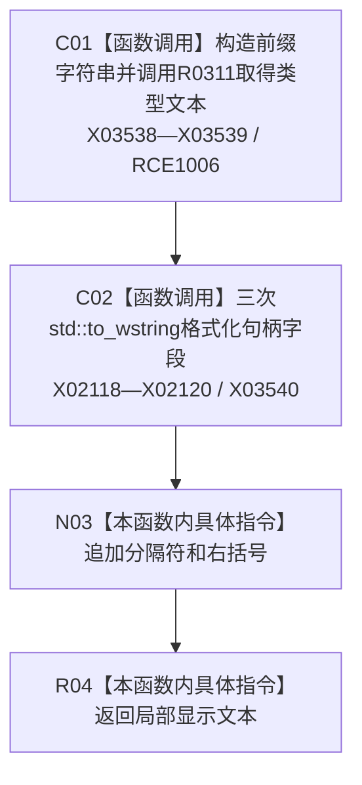

# CF-L11-0058 生成回退显示名称现状流程图

图类型：现状流程图
代码版本：`3920a74638264f9f539d50f32f3c9fe5fb1982ab`
源码 blob：`b0b4cdc2cd7e7fd6801f36c7a43bc27595ca89d9`
覆盖文件：`海中鱼巣/领域/控制面板服务.h:612-623`
唯一根函数：R0312
完整签名：`static std::wstring 海中鱼巣::控制面板服务::生成回退显示名称(节点类型 类型, 节点句柄 节点值)`
参数：节点类型和节点句柄均按值传入
返回结果：返回“<类型> [仓库:节点:版本]”格式的非权威显示文本
已登记调用方：RCE1035（R0324）、RCE1040（R0325）
直接项目函数：RCE1006 → R0311；外部边界：X02118—X02120、X03538—X03540；未解析项目调用：0
逐行映射表：`流程图/代码流程图/L11/CF-L11-0058_生成回退显示名称_逐行代码映射表.md`
依据：冻结源码与当前正式调用关系
结构读写：只构造局部字符串
不得作为施工许可：是
不得宣称：显示名称是节点身份、类型或存在性事实

## 流程图

## 当前边界

- 函数不读取节点仓库，也不复核句柄有效性。
