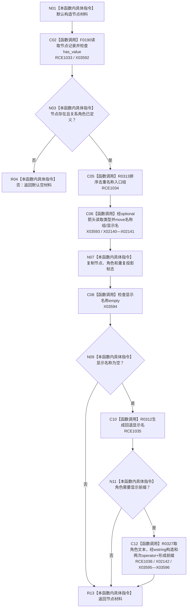

# CF-L11-0059 生成节点材料现状流程图

图类型：现状流程图
代码版本：`3920a74638264f9f539d50f32f3c9fe5fb1982ab`
源码 blob：`b0b4cdc2cd7e7fd6801f36c7a43bc27595ca89d9`
覆盖文件：`海中鱼巣/领域/控制面板服务.h:872-901`
唯一根函数：R0324
完整签名：`控制面板树节点材料 海中鱼巣::控制面板服务::生成节点材料(节点句柄 节点值, 控制面板树关系角色 关系角色, std::vector<节点句柄> 名称入口组 = {}, std::wstring 显示名称 = {}, bool 重复投影 = false) const`
参数：节点、角色、名称入口组、显示名称和重复投影均按值传入
返回结果：节点存在且角色已定义时返回填充材料；否则返回默认空材料
已登记调用方：RCE0897、RCE0902、RCE0923、RCE0945、RCE0955、RCE1047
直接项目函数：RCE1033 → F0190、RCE1034 → R0313、RCE1035 → R0312、RCE1036 → R0327
外部边界：X02140—X02142、X03592—X03596；未解析项目调用：0
逐行映射表：`流程图/代码流程图/L11/CF-L11-0059_生成节点材料_逐行代码映射表.md`
依据：冻结源码与当前正式调用关系
结构读写：只读节点仓库并构造局部显示材料
不得作为施工许可：是
不得宣称：节点材料是节点或关系的第二权威账

## 流程图

## 当前边界

- 显示名称只作只读投影；角色前缀不参与关系裁决。
