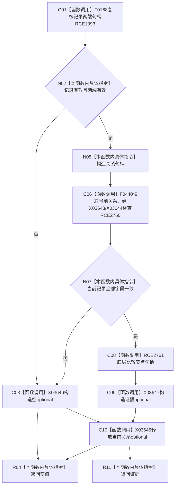

# CF-L11-0060 特征体系读取关系证据已许可现状流程图

图类型：现状流程图
代码版本：`3920a74638264f9f539d50f32f3c9fe5fb1982ab`
源码 blob：`a47cd9b07794d30abc6cb9d1df319056105cd596`
覆盖文件：`海中鱼巣/领域/数据操作.特征体系.ixx:1051-1064`
唯一根函数：R0346
完整签名：`std::optional<海中鱼巣::特征关系证据> 海中鱼巣::特征体系数据操作::读取关系证据_已许可(const 海中鱼巣::关系记录& 记录, const 海中鱼巣::结构事务令牌& 令牌) const`
直接项目函数：RCE1093；RCE2760—RCE2761
符号外部边界：X03643—X03647
逐行映射表：`流程图/代码流程图/L11/CF-L11-0060_特征体系读取关系证据已许可_逐行代码映射表.md`
不得作为施工许可：是

## 流程图

## 当前边界

- 任一字段漂移返回空 optional，不修改关系。
