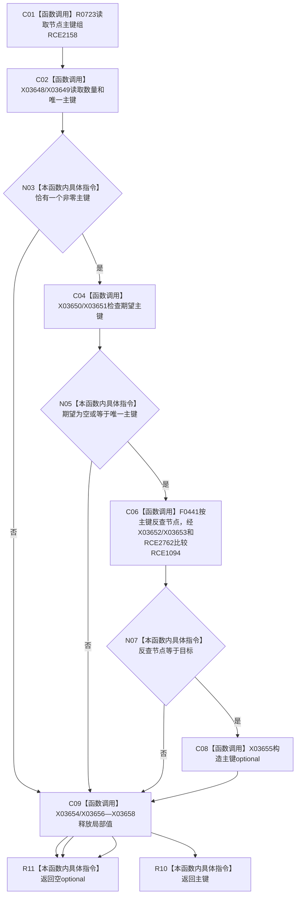

# CF-L11-0061 特征体系读取唯一主键已许可现状流程图

图类型：现状流程图
代码版本：`3920a74638264f9f539d50f32f3c9fe5fb1982ab`
源码 blob：`a47cd9b07794d30abc6cb9d1df319056105cd596`
覆盖文件：`海中鱼巣/领域/数据操作.特征体系.ixx:1066-1077`
唯一根函数：R0347
完整签名：`std::optional<std::uint64_t> 海中鱼巣::特征体系数据操作::读取唯一主键_已许可(海中鱼巣::节点句柄 目标, std::optional<std::uint64_t> 期望主键, const 海中鱼巣::结构事务令牌& 令牌) const`
直接项目函数：RCE1094、RCE2158；RCE2762
符号外部边界：X03648—X03658
逐行映射表：`流程图/代码流程图/L11/CF-L11-0061_特征体系读取唯一主键已许可_逐行代码映射表.md`
不得作为施工许可：是

## 流程图

## 当前边界

- 只接受唯一非零主键且双向索引一致。
