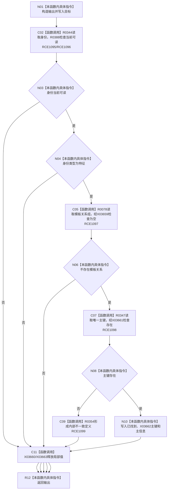

# CF-L11-0062 特征体系读取特征定义已许可现状流程图

图类型：现状流程图
代码版本：`3920a74638264f9f539d50f32f3c9fe5fb1982ab`
源码 blob：`a47cd9b07794d30abc6cb9d1df319056105cd596`
覆盖文件：`海中鱼巣/领域/数据操作.特征体系.ixx:1079-1104`
唯一根函数：R0348
完整签名：`海中鱼巣::特征定义值式材料 海中鱼巣::特征体系数据操作::读取特征定义_已许可(海中鱼巣::节点句柄 目标, std::optional<std::uint64_t> 期望主键, const 海中鱼巣::结构事务令牌& 令牌) const`
直接项目函数：RCE1095—RCE1099
符号外部边界：X03659—X03663
逐行映射表：`流程图/代码流程图/L11/CF-L11-0062_特征体系读取特征定义已许可_逐行代码映射表.md`
不得作为施工许可：是

## 流程图

## 当前边界

- 特征定义不得拥有模板出边，且必须具备唯一非零主键。
