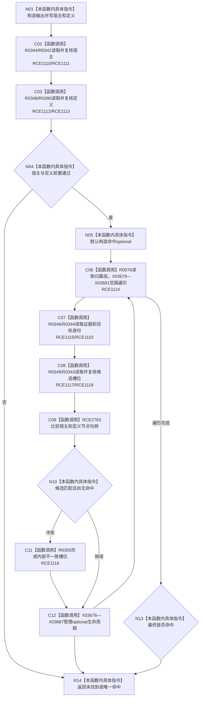

# CF-L11-0064 特征体系读取宿主定义槽位已许可现状流程图

图类型：现状流程图
代码版本：`3920a74638264f9f539d50f32f3c9fe5fb1982ab`
源码 blob：`a47cd9b07794d30abc6cb9d1df319056105cd596`
覆盖文件：`海中鱼巣/领域/数据操作.特征体系.ixx:1154-1192`
唯一根函数：R0350
完整签名：`海中鱼巣::特征槽位值式材料 海中鱼巣::特征体系数据操作::读取宿主定义槽位_已许可(海中鱼巣::节点句柄 宿主, 海中鱼巣::节点句柄 特征定义, const 海中鱼巣::结构事务令牌& 令牌) const`
直接项目函数：RCE1110—RCE1118；RCE2763
符号外部边界：X03676—X03687
逐行映射表：`流程图/代码流程图/L11/CF-L11-0064_特征体系读取宿主定义槽位已许可_逐行代码映射表.md`
不得作为施工许可：是

## 流程图

## 当前边界

- 同一宿主与定义最多允许一个完整槽位；重复命中为内部不一致。
