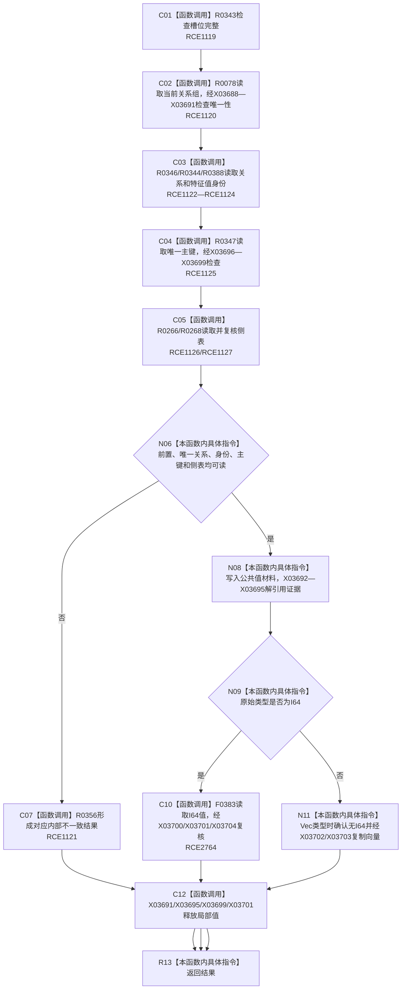

# CF-L11-0065 特征体系读取当前值已许可现状流程图

图类型：现状流程图
代码版本：`3920a74638264f9f539d50f32f3c9fe5fb1982ab`
源码 blob：`a47cd9b07794d30abc6cb9d1df319056105cd596`
覆盖文件：`海中鱼巣/领域/数据操作.特征体系.ixx:1194-1244`
唯一根函数：R0351
完整签名：`海中鱼巣::特征原始值式材料 海中鱼巣::特征体系数据操作::读取当前值_已许可(const 海中鱼巣::特征槽位值式材料& 槽位, const 海中鱼巣::结构事务令牌& 令牌) const`
直接项目函数：RCE1119—RCE1127；RCE2764
符号外部边界：X03688—X03704
逐行映射表：`流程图/代码流程图/L11/CF-L11-0065_特征体系读取当前值已许可_逐行代码映射表.md`
不得作为施工许可：是

## 流程图

## 当前边界

- 许可竞争映射为许可拒绝；材料缺失或载荷互相矛盾归为内部不一致。
