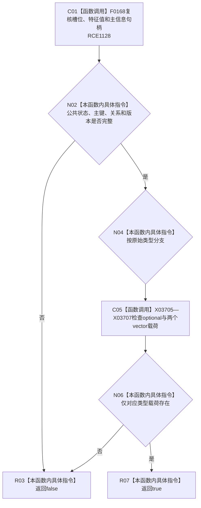

# CF-L11-0066 特征原始值式材料完整现状流程图

图类型：现状流程图
代码版本：`3920a74638264f9f539d50f32f3c9fe5fb1982ab`
源码 blob：`a47cd9b07794d30abc6cb9d1df319056105cd596`
覆盖文件：`海中鱼巣/领域/数据操作.特征体系.ixx:123-139`
唯一根函数：R0352
完整签名：`bool 海中鱼巣::特征原始值式材料::完整() const noexcept`
参数：无；只读当前材料
返回结果：公共字段完整且值载荷与原始类型唯一匹配时返回 `true`
直接项目函数：RCE1128 → F0168
符号外部边界：X03705—X03707
逐行映射表：`流程图/代码流程图/L11/CF-L11-0066_特征原始值式材料完整_逐行代码映射表.md`
不得作为施工许可：是

## 流程图

## 当前边界

- 三种原始载荷互斥；未建立或未知类型返回 `false`。
