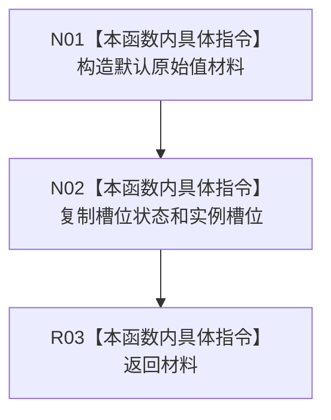

# CF-L11-0068 特征体系从槽位失败形成值现状流程图

图类型：现状流程图
代码版本：`3920a74638264f9f539d50f32f3c9fe5fb1982ab`
源码 blob：`a47cd9b07794d30abc6cb9d1df319056105cd596`
覆盖文件：`海中鱼巣/领域/数据操作.特征体系.ixx:1418-1423`
唯一根函数：R0357
完整签名：`static 海中鱼巣::特征原始值式材料 海中鱼巣::特征体系数据操作::从槽位失败形成值(const 海中鱼巣::特征槽位值式材料& 槽位)`
直接项目函数：无
外部边界：无
逐行映射表：`流程图/代码流程图/L11/CF-L11-0068_特征体系从槽位失败形成值_逐行代码映射表.md`
不得作为施工许可：是

## 流程图

## 当前边界

- 只投影槽位失败状态，不读取当前值。
