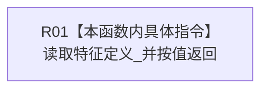

# CF-L11-0071 特征槽位写入规格读取特征定义现状流程图

图类型：现状流程图
代码版本：`3920a74638264f9f539d50f32f3c9fe5fb1982ab`
源码 blob：`a47cd9b07794d30abc6cb9d1df319056105cd596`
覆盖文件：`海中鱼巣/领域/数据操作.特征体系.ixx:270`
唯一根函数：R0373
完整签名：`海中鱼巣::节点句柄 海中鱼巣::特征槽位写入规格::读取特征定义() const noexcept`
参数：无；只读当前规格对象
返回结果：按值返回特征定义_
已登记调用方：R0361、R0363（RCE1163、RCE1179）
直接项目函数：无；外部边界：无；未解析项目调用：0
逐行映射表：`流程图/代码流程图/L11/CF-L11-0071_特征槽位写入规格读取特征定义_逐行代码映射表.md`
依据：关系发布基线 `8d93afa94c066dd8728938e2a40f3a9f3c0c0d52` 与冻结源码
结构读取与写入：只读成员
不得作为施工许可：是
不得宣称：返回句柄已经通过有效性或节点类型复核

## 流程图

## 当前边界

- 本函数不读取特征定义记录。
