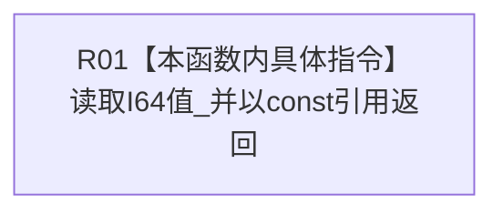

# CF-L11-0074 初始特征值写入规格读取I64值现状流程图

图类型：现状流程图
代码版本：`3920a74638264f9f539d50f32f3c9fe5fb1982ab`
源码 blob：`a47cd9b07794d30abc6cb9d1df319056105cd596`
覆盖文件：`海中鱼巣/领域/数据操作.特征体系.ixx:294`
唯一根函数：R0377
完整签名：`const std::optional<std::int64_t>& 海中鱼巣::初始特征值写入规格::读取I64值() const noexcept`
参数：无；只读当前规格对象
返回结果：以 const 引用返回 I64值_；引用生命周期受当前规格对象约束
已登记调用方：R0362、R0364（RCE1170、RCE1183）
直接项目函数：无；外部边界：无；未解析项目调用：0
逐行映射表：`流程图/代码流程图/L11/CF-L11-0074_初始特征值写入规格读取I64值_逐行代码映射表.md`
依据：关系发布基线 `8d93afa94c066dd8728938e2a40f3a9f3c0c0d52` 与冻结源码
结构读取与写入：只读成员
不得作为施工许可：是
不得宣称：返回 optional 必然有值

## 流程图

## 当前边界

- 调用方不得让返回引用超出规格对象生命周期。
