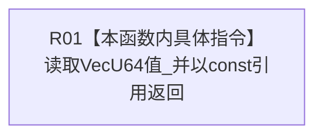

# CF-L11-0076 初始特征值写入规格读取VecU64值现状流程图

图类型：现状流程图
代码版本：`3920a74638264f9f539d50f32f3c9fe5fb1982ab`
源码 blob：`a47cd9b07794d30abc6cb9d1df319056105cd596`
覆盖文件：`海中鱼巣/领域/数据操作.特征体系.ixx:296`
唯一根函数：R0379
完整签名：`const std::vector<std::uint64_t>& 海中鱼巣::初始特征值写入规格::读取VecU64值() const noexcept`
参数：无；只读当前规格对象
返回结果：以 const 引用返回 `VecU64值_`；引用生命周期受当前规格对象约束
调用图：`流程图/主程序可达调用关系/01_main可达项目调用边表.md`
已登记调用方：R0362、R0364（RCE1172、RCE1185）
直接项目函数：无
外部边界：无
未解析项目调用：0
逐行映射表：`流程图/代码流程图/L11/CF-L11-0076_初始特征值写入规格读取VecU64值_逐行代码映射表.md`
依据提交 / 结构化消息：调用关系发布基线 `caab8644416dea13ea598b714289d1c86ac05304`；冻结源码提交 `3920a74638264f9f539d50f32f3c9fe5fb1982ab`
结构读取与写入：只读成员，不改写机器结构
逻辑内返回：无
内部错误边界：无
不得作为施工许可：是
不得宣称：返回向量非空、已经通过值域准入或已经发布

## 流程图

## 当前边界

- 调用方不得让返回引用超出当前规格对象生命周期。
- 本函数不检查元素数量、原始类型或规格完整性。
