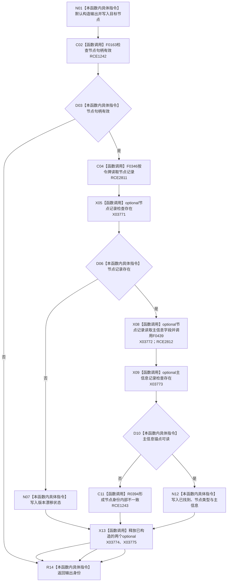

# CF-L11-0077 状态动态读取节点身份已许可现状流程图

图类型：现状流程图
代码版本：`3920a74638264f9f539d50f32f3c9fe5fb1982ab`
源码 blob：`cc399ea69282bf3ae0b0d59c7f0b587e5164b187`
覆盖文件：`海中鱼巣/领域/数据操作.状态动态.ixx:1009-1027`
唯一根函数：R0392
完整签名：`海中鱼巣::节点值式身份 海中鱼巣::状态动态数据操作::读取节点身份_已许可(海中鱼巣::节点句柄 节点, const 海中鱼巣::结构事务令牌& 令牌) const`
参数：`节点` 按值传入；`令牌` 为只读借用，函数不延长其生命周期
返回结果：无效节点返回默认入口拒绝材料；节点记录缺失返回版本漂移；主信息缺失经 R0394 返回内部不一致；完整读回返回已找到身份
已登记调用方：R0396、R0669、R0670、R0679（RCE1247、RCE1995、RCE2007、RCE2012）
直接项目函数：F0163（RCE1242，校正原误绑 F0168）、R0394（RCE1243）、F0346（RCE2811）、F0439（RCE2812）
外部边界：X03771—X03775
逐行映射表：`流程图/代码流程图/L11/CF-L11-0077_状态动态读取节点身份已许可_逐行代码映射表.md`
结构读取与写入：只读节点仓库与主信息仓库，不改变机器结构
逻辑内返回：无效节点、节点记录版本漂移
内部错误边界：当前节点记录存在但主信息锚点不可读
不得作为施工许可：是
不得宣称：返回已找到代表该身份在令牌生命周期外仍保持当前

## 流程图

## 当前边界

- RCE1242 的实参静态类型是 `节点句柄`，被调方应为 F0163；原聚合误绑 F0168（关系句柄重载）。
- X03771—X03775 分别覆盖节点记录存在检查、节点记录 `operator->`、主信息记录存在检查及两个 optional 的析构。
