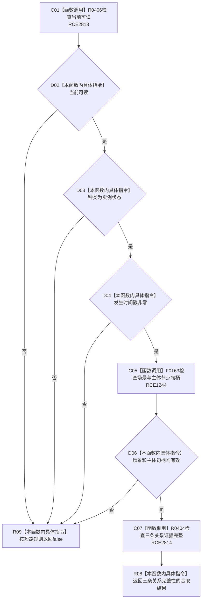

# CF-L11-0078 状态值式材料完整实例状态现状流程图

图类型：现状流程图
代码版本：`3920a74638264f9f539d50f32f3c9fe5fb1982ab`
源码 blob：`cc399ea69282bf3ae0b0d59c7f0b587e5164b187`
覆盖文件：`海中鱼巣/领域/数据操作.状态动态.ixx:101-105`
唯一根函数：R0393
完整签名：`bool 海中鱼巣::状态值式材料::完整实例状态() const noexcept`
参数：无显式参数；隐式 `this` 为只读借用
返回结果：当前可读、种类为实例状态、时间戳非零、场景和主体句柄有效且三条关系证据完整时返回 `true`，否则按短路规则返回 `false`
已登记调用方：R0401、R0669（RCE1255、RCE2004）
直接项目函数：R0406（RCE2813）、F0163（RCE1244，校正原误绑 F0168）、R0404（RCE2814）
外部边界：无
逐行映射表：`流程图/代码流程图/L11/CF-L11-0078_状态值式材料完整实例状态_逐行代码映射表.md`
结构读取与写入：只读当前值式材料，不改变机器结构
不得作为施工许可：是

## 流程图

## 当前边界

- RCE1244 两个调用的实参都是 `节点句柄`，被调方应为 F0163。
- 本函数只判断值式投影是否自洽，不重新读仓库，也不证明材料仍为当前版本。
