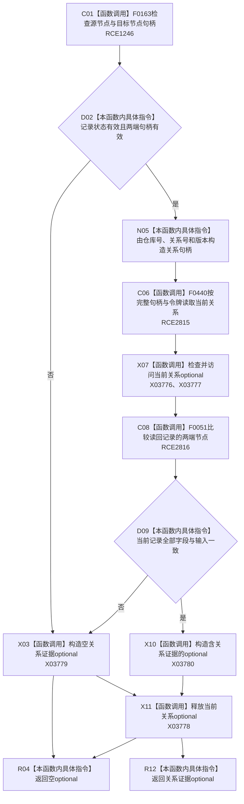

# CF-L11-0079 状态动态读取关系证据已许可现状流程图

图类型：现状流程图
代码版本：`3920a74638264f9f539d50f32f3c9fe5fb1982ab`
源码 blob：`cc399ea69282bf3ae0b0d59c7f0b587e5164b187`
覆盖文件：`海中鱼巣/领域/数据操作.状态动态.ixx:1037-1050`
唯一根函数：R0395
完整签名：`std::optional<海中鱼巣::关系值式证据> 海中鱼巣::状态动态数据操作::读取关系证据_已许可(const 海中鱼巣::关系记录& 记录, const 海中鱼巣::结构事务令牌& 令牌) const`
参数：`记录` 与 `令牌` 均为只读借用
返回结果：输入记录或按完整句柄读回的当前记录不完整时返回空 optional；全部字段一致时返回关系值式证据
已登记调用方：R0396、R0669、R0670（RCE1252、RCE2001、RCE2009）
直接项目函数：F0163（RCE1246，校正原误绑 F0168）、F0440（RCE2815）、F0051（RCE2816）
外部边界：X03776—X03780
逐行映射表：`流程图/代码流程图/L11/CF-L11-0079_状态动态读取关系证据已许可_逐行代码映射表.md`
结构读取与写入：只读关系仓库，不改变机器结构
逻辑内返回：输入记录无效或读回字段漂移时返回空 optional
不得作为施工许可：是

## 流程图

## 当前边界

- RCE1246 两个调用的实参都是 `节点句柄`，被调方应为 F0163。
- 空 optional 表达当前输入或读回证据不可用；本函数不把它升级为内部错误。
