# CF-L11-0080 状态动态读取状态材料已许可现状流程图

图类型：现状流程图
代码版本：`3920a74638264f9f539d50f32f3c9fe5fb1982ab`
源码 blob：`cc399ea69282bf3ae0b0d59c7f0b587e5164b187`
覆盖文件：`海中鱼巣/领域/数据操作.状态动态.ixx:1052-1144`
唯一根函数：R0396
完整签名：`海中鱼巣::状态值式材料 海中鱼巣::状态动态数据操作::读取状态材料_已许可(海中鱼巣::节点句柄 状态节点, std::optional<std::uint64_t> 期望主键, const 海中鱼巣::结构事务令牌& 令牌) const`
参数：`状态节点` 按值传入；`期望主键` 按值传入并由本函数结束其生命周期；`令牌` 为只读借用
返回结果：身份失败或类型不匹配时返回结构化读取状态；期望主键不匹配时返回仅含当前主键的已找到材料；完整抽象状态或完整实例状态返回对应值式材料；读回结构缺项或重复时经 R0397 返回内部不一致
已登记调用方：R0402、R0669、R0767（RCE1263、RCE2003、RCE2635）
直接项目函数：R0392（RCE1247）、R0397（RCE1248）、R0082（RCE1249）、R0408（RCE1250）、R0078（RCE1251）、R0395（RCE1252）、R0723（RCE2159）、F0383（RCE2817）、R0664（RCE2818）、F0051（RCE2819）
外部边界：X03781—X03802
逐行映射表：`流程图/代码流程图/L11/CF-L11-0080_状态动态读取状态材料已许可_逐行代码映射表.md`
结构读取与写入：只读节点、主信息、索引和关系仓库；只写局部返回材料，不改变机器结构
逻辑内返回：身份读取失败、类型不匹配、期望主键与当前主键不匹配、完整抽象状态或完整实例状态读回
内部错误边界：前置身份成立后出现值槽、唯一主键、实例双槽或关系证据缺失、重复、漂移
不得作为施工许可：是
不得宣称：已找到材料在令牌生命周期外仍为当前事实

## 流程图

```mermaid
flowchart TD
    N01["N01【本函数内具体指令】默认构造输出并写入状态节点"]
    C02["C02【函数调用】R0392读取节点身份<br/>RCE1247"]
    D03{"D03【本函数内具体指令】身份状态为已找到"}
    N04["N04【本函数内具体指令】复制身份读取状态到输出"]
    D05{"D05【本函数内具体指令】身份类型为状态"}
    N06["N06【本函数内具体指令】写入类型不匹配状态"]
    N07["N07【本函数内具体指令】写入身份主信息"]
    C08["C08【函数调用】F0383读取状态值槽<br/>RCE2817"]
    X09["X09【函数调用】检查并解引用I64 optional<br/>X03787、X03788"]
    D10{"D10【本函数内具体指令】状态值槽存在"}
    C11["C11【函数调用】R0397形成状态内部不一致<br/>RCE1248"]
    N12["N12【本函数内具体指令】写入状态值"]
    C13["C13【函数调用】R0723读取节点主键组<br/>RCE2159"]
    X14["X14【函数调用】读取vector大小与首项<br/>X03781、X03782"]
    D15{"D15【本函数内具体指令】主键组恰一且首项非零"}
    N16["N16【本函数内具体指令】写入唯一幂等主键"]
    X17["X17【函数调用】检查并解引用期望主键optional<br/>X03784、X03785"]
    D18{"D18【本函数内具体指令】存在期望主键且与当前主键不一致"}
    N19["N19【本函数内具体指令】写入已找到状态"]
    C20["C20【函数调用】F0383读取时间、幂等低位和高位三个I64槽<br/>RCE2817"]
    D21{"D21【本函数内具体指令】时间槽不存在"}
    D22{"D22【本函数内具体指令】低位槽存在"}
    D23{"D23【本函数内具体指令】高位槽存在"}
    C24["C24【函数调用】R0082检查运行期临时目标关系<br/>RCE1249"]
    D25{"D25【本函数内具体指令】存在实例专用槽或运行期关系"}
    N26["N26【本函数内具体指令】写入已找到与抽象状态种类"]
    D27{"D27【本函数内具体指令】时间、低高位存在且在合法数值范围"}
    C28["C28【函数调用】R0408合并幂等低高位<br/>RCE1250"]
    D29{"D29【本函数内具体指令】合并主键非零且等于索引主键"}
    X30["X30【函数调用】默认构造主体与场景关系optional<br/>X03796"]
    C31["C31【函数调用】R0078读取状态节点引用关系组<br/>RCE1251"]
    X32["X32【函数调用】建立关系vector遍历<br/>X03790—X03794"]
    D33{"D33【本函数内具体指令】还有引用关系记录"}
    C34["C34【函数调用】R0395读回关系证据<br/>RCE1252"]
    X35["X35【函数调用】检查关系证据optional<br/>X03797"]
    D36{"D36【本函数内具体指令】关系证据可读"}
    C37["C37【函数调用】R0392读取目标节点身份<br/>RCE1247"]
    C38["C38【函数调用】R0664检查目标身份当前可读<br/>RCE2818"]
    D39{"D39【本函数内具体指令】目标身份当前可读"}
    D40{"D40【本函数内具体指令】目标类型为存在、场景或其它"}
    X41["X41【函数调用】检查主体关系optional<br/>X03797"]
    D42{"D42【本函数内具体指令】主体关系已经存在"}
    X43["X43【函数调用】复制证据到主体关系optional<br/>X03798"]
    X44["X44【函数调用】检查场景关系optional<br/>X03797"]
    D45{"D45【本函数内具体指令】场景关系已经存在"}
    X46["X46【函数调用】复制证据到场景关系optional<br/>X03798"]
    X47["X47【函数调用】递增关系vector迭代器<br/>X03794"]
    D48{"D48【本函数内具体指令】主体关系与场景关系均存在"}
    X49["X49【函数调用】默认构造场景临时关系optional<br/>X03796"]
    X50["X50【函数调用】经场景关系optional读取场景节点<br/>X03799"]
    C51["C51【函数调用】R0078读取场景运行期临时关系组<br/>RCE1251"]
    X52["X52【函数调用】建立第二个关系vector遍历<br/>X03790—X03794"]
    D53{"D53【本函数内具体指令】还有运行期临时关系记录"}
    C54["C54【函数调用】F0051比较关系目标与状态节点<br/>RCE2819"]
    D55{"D55【本函数内具体指令】关系目标为当前状态节点"}
    C56["C56【函数调用】R0395读回场景临时关系证据<br/>RCE1252"]
    X57["X57【函数调用】检查场景临时证据optional<br/>X03797"]
    D58{"D58【本函数内具体指令】证据可读"}
    X59["X59【函数调用】检查临时关系optional<br/>X03797"]
    D60{"D60【本函数内具体指令】临时关系已经存在"}
    X61["X61【函数调用】复制证据到临时关系optional<br/>X03798"]
    X62["X62【函数调用】递增第二个关系vector迭代器<br/>X03794"]
    D63{"D63【本函数内具体指令】最终存在场景临时关系"}
    N64["N64【本函数内具体指令】写入已找到与实例状态种类"]
    X65["X65【函数调用】转换时间戳并写入发生时间<br/>X03802"]
    X66["X66【函数调用】经关系optional读取主体与场景节点<br/>X03799"]
    X67["X67【函数调用】解引用三个关系optional并写入证据<br/>X03800"]
    X90["X90【函数调用】释放当前路径已构造的optional与vector<br/>X03783、X03786、X03789、X03795、X03801"]
    R91["R91【本函数内具体指令】返回当前路径形成的状态材料"]

    N01 --> C02 --> D03
    D03 -- 否 --> N04 --> X90 --> R91
    D03 -- 是 --> D05
    D05 -- 否 --> N06 --> X90
    D05 -- 是 --> N07 --> C08 --> X09 --> D10
    D10 -- 否 --> C11 --> X90
    D10 -- 是 --> N12 --> C13 --> X14 --> D15
    D15 -- 否 --> C11
    D15 -- 是 --> N16 --> X17 --> D18
    D18 -- 是 --> N19 --> X90
    D18 -- 否 --> C20 --> D21
    D21 -- 是 --> D22
    D22 -- 是 --> C11
    D22 -- 否 --> D23
    D23 -- 是 --> C11
    D23 -- 否 --> C24 --> D25
    D25 -- 是 --> C11
    D25 -- 否 --> N26 --> X90
    D21 -- 否 --> D27
    D27 -- 否 --> C11
    D27 -- 是 --> C28 --> D29
    D29 -- 否 --> C11
    D29 -- 是 --> X30 --> C31 --> X32 --> D33
    D33 -- 否 --> D48
    D33 -- 是 --> C34 --> X35 --> D36
    D36 -- 否 --> C11
    D36 -- 是 --> C37 --> C38 --> D39
    D39 -- 否 --> C11
    D39 -- 是 --> D40
    D40 -- 存在 --> X41 --> D42
    D42 -- 是 --> C11
    D42 -- 否 --> X43 --> X47
    D40 -- 场景 --> X44 --> D45
    D45 -- 是 --> C11
    D45 -- 否 --> X46 --> X47
    D40 -- 其它 --> X47
    X47 --> D33
    D48 -- 否 --> C11
    D48 -- 是 --> X49 --> X50 --> C51 --> X52 --> D53
    D53 -- 否 --> D63
    D53 -- 是 --> C54 --> D55
    D55 -- 否 --> X62 --> D53
    D55 -- 是 --> C56 --> X57 --> D58
    D58 -- 否 --> C11
    D58 -- 是 --> X59 --> D60
    D60 -- 是 --> C11
    D60 -- 否 --> X61 --> X62
    D63 -- 否 --> C11
    D63 -- 是 --> N64 --> X65 --> X66 --> X67 --> X90
```

## 当前边界

- 抽象状态路径要求没有时间槽、幂等双槽和运行期临时目标关系；实例状态路径要求时间、双槽、唯一主体、唯一场景和唯一场景临时关系全部闭合。
- 两个范围循环各持有一个临时 `vector<关系记录>`；全部早退路径都释放当时已经构造的 vector 和 optional。
- X03798 的精确静态签名是 `optional<关系值式证据>` 的 optional-to-optional 拷贝赋值；旧同类边界把它简写成从证据赋值。
