# CF-L11-0081 状态动态写入抽象状态结构会话现状流程图

图类型：现状流程图
代码版本：`3920a74638264f9f539d50f32f3c9fe5fb1982ab`
源码 blob：`cc399ea69282bf3ae0b0d59c7f0b587e5164b187`
覆盖文件：`海中鱼巣/领域/数据操作.状态动态.ixx:896-924`
唯一根函数：R0405
完整签名：`bool 海中鱼巣::状态动态数据操作::写入抽象状态结构_会话(海中鱼巣::结构写入会话& 会话, std::uint64_t 主键, std::int64_t 状态值, 海中鱼巣::状态值式材料& 输出) const`
参数：`会话` 为调用期可写借用；`主键` 与 `状态值` 按值传入；`输出` 为调用方拥有的可写借用
返回结果：主键非零，主信息、I64 值、状态节点和主键绑定候选全部形成且完整读回，并且输出完整抽象状态时返回 true；任一步失败返回 false
已登记调用方：R0403（RCE1265）
直接项目函数：R0021（RCE1269）、R0640（RCE2824，待聚合）、R0028（RCE1270）、R0138（RCE2825，待聚合）、R0022（RCE1271）、R0641（RCE2826，待聚合）、R0129（RCE1273）、R0027（RCE1272）、R0036（RCE1274）、R0029（RCE1275）、R0037（RCE1276）、R0638（RCE2166）、R0407（RCE1278）
外部边界：X03806—X03809（两个带值结果的 optional 解引用与析构，待聚合）
逐行映射表：`流程图/代码流程图/L11/CF-L11-0081_状态动态写入抽象状态结构会话_逐行代码映射表.md`
结构读取与写入：在既有会话中形成主信息候选、I64 状态值、状态节点候选和状态域主键绑定，并使用会话内读回接口复核；只写调用方输出材料，不负责确认或发布
逻辑内返回：仅主键为零的写前 false 可作为封闭入口拒绝
内部错误边界：主键通过后任一候选创建、值写入、绑定、读回或输出完整性失败均是前置通过后的内部不一致对象
依据提交 / 结构化消息：聚合关系基线 `caab8644416dea13ea598b714289d1c86ac05304`；冻结源码提交 `3920a74638264f9f539d50f32f3c9fe5fb1982ab`
验证输出：本批 Mermaid、节点双向、源码覆盖与差异格式检查
不得作为施工许可：是
不得宣称：返回 true 表示候选已经确认、发布或普通读取路径可见

## 流程图

```mermaid
flowchart TD
    N00["N00【本函数内具体指令】绑定会话、主键、状态值与输出借用"]
    B01{"B01【本函数内具体指令】主键是否非零"}
    R02["R02【本函数内具体指令】返回false"]
    C03["C03【函数调用】R0021 创建主信息候选() -> 主结果<br/>RCE1269"]
    C04["C04【函数调用】R0640 主结果.成功() -> bool<br/>RCE2824"]
    B05{"B05【本函数内具体指令】主信息候选是否成功"}
    X06["X06【函数调用】X03806 解引用主信息句柄optional"]
    N07["N07【本函数内具体指令】绑定局部主信息句柄"]
    C08["C08【函数调用】R0028 写入候选I64值(主信息,状态值槽位,状态值) -> 结果<br/>RCE1270"]
    C09["C09【函数调用】R0138 结构写入结果.成功() -> bool<br/>RCE2825"]
    B10{"B10【本函数内具体指令】I64值候选是否写入成功"}
    C11["C11【函数调用】R0022 创建状态节点候选(状态,主信息) -> 节点结果<br/>RCE1271"]
    C12["C12【函数调用】R0641 节点结果.成功() -> bool<br/>RCE2826"]
    B13{"B13【本函数内具体指令】状态节点候选是否成功"}
    X14["X14【函数调用】X03808 解引用状态节点句柄optional"]
    N15["N15【本函数内具体指令】绑定局部状态节点句柄"]
    C16["C16【函数调用】R0129 形成索引绑定请求(主键,状态节点,状态动态) -> 请求<br/>RCE1273"]
    C17["C17【函数调用】R0027 绑定主键(请求) -> 结果<br/>RCE1272"]
    C18["C18【函数调用】R0138 结构写入结果.成功() -> bool<br/>RCE2825"]
    B19{"B19【本函数内具体指令】主键绑定是否成功"}
    C20["C20【函数调用】R0036 主信息可读(主信息) -> bool<br/>RCE1274"]
    B21{"B21【本函数内具体指令】主信息是否可读"}
    C22["C22【函数调用】R0029 候选I64值匹配(主信息,槽位,状态值) -> bool<br/>RCE1275"]
    B23{"B23【本函数内具体指令】候选I64值是否匹配"}
    C24["C24【函数调用】R0037 节点可读(状态节点) -> bool<br/>RCE1276"]
    B25{"B25【本函数内具体指令】状态节点是否可读"}
    C26["C26【函数调用】R0638 主键绑定匹配(主键,状态节点) -> bool<br/>RCE2166"]
    B27{"B27【本函数内具体指令】全部会话内读回是否完整"}
    N28["N28【本函数内具体指令】写入输出状态、种类、主键、节点、主信息和值"]
    C29["C29【函数调用】R0407 输出.完整抽象状态() -> bool<br/>RCE1278"]
    X90["X90【函数调用】按已构造路径逆序析构节点与主信息optional<br/>X03809、X03807"]
    R91["R91【本函数内具体指令】返回当前路径布尔结果"]
    N00 --> B01
    B01 -- 否 --> R02
    B01 -- 是 --> C03 --> C04 --> B05
    B05 -- 否 --> X90 --> R91
    B05 -- 是 --> X06 --> N07 --> C08 --> C09 --> B10
    B10 -- 否 --> X90
    B10 -- 是 --> C11 --> C12 --> B13
    B13 -- 否 --> X90
    B13 -- 是 --> X14 --> N15 --> C16 --> C17 --> C18 --> B19
    B19 -- 否 --> X90
    B19 -- 是 --> C20 --> B21
    B21 -- 否 --> X90
    B21 -- 是 --> C22 --> B23
    B23 -- 否 --> X90
    B23 -- 是 --> C24 --> B25
    B25 -- 否 --> X90
    B25 -- 是 --> C26 --> B27
    B27 -- 否 --> X90
    B27 -- 是 --> N28 --> C29 --> X90 --> R91
```

## 当前边界

- RCE1277 把第 914 行双参数 `主键绑定匹配(std::uint64_t, 节点句柄)` 误绑为 R0040 单参数请求重载，必须停用；真实调用只由 RCE2166 → R0638 承载。
- R0640、R0641 分别复核主信息句柄和节点句柄带值结果；R0138 复核两次普通结构写入结果，均是遗漏的直接项目调用。
- X03806/X03808 分别解引用两个 `const auto` 带值结果中的 `const optional`；X03809、X03807 按局部对象逆序析构，早退路径只释放当时已经构造的对象。
- 本函数只在会话内形成候选和读回，不调用确认或发布入口；事务最后发布由上层会话执行路径承载。
