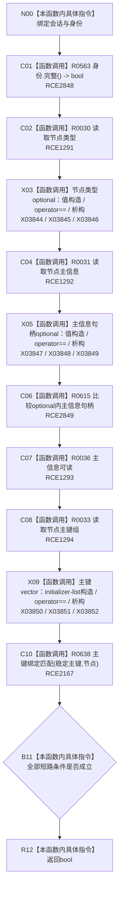

# CF-L11-0082 系统角色复核身份会话现状流程图

图类型：现状流程图
代码版本：`3920a74638264f9f539d50f32f3c9fe5fb1982ab`
源码 blob：`b24322d4588808299a232bc308bebd463b7a87a0`
覆盖文件：`海中鱼巣/领域/数据操作.系统角色.ixx:243-253`
唯一根函数：R0414
完整签名：`bool 海中鱼巣::系统角色数据操作::复核身份_会话(海中鱼巣::结构写入会话& 会话, const 海中鱼巣::系统角色身份材料& 身份) const`
参数：`会话` 为可写会话借用但本函数只读；`身份` 为只读借用
返回结果：身份完整且会话内节点类型、主信息、主信息可读性、单项主键组和双参数主键绑定全部匹配时返回 true，否则 false
已登记调用方：R0415（RCE1297）
直接项目函数：R0563（RCE2848）、R0030（RCE1291）、R0031（RCE1292）、R0615（RCE2849）、R0036（RCE1293）、R0033（RCE1294）、R0638（RCE2167）
停用误边：RCE1295（错误指向 R0040 单参数重载）
外部边界：X03844—X03852
逐行映射表：`流程图/代码流程图/L11/CF-L11-0082_系统角色复核身份会话_逐行代码映射表.md`
结构读取与写入：只读当前会话内候选及已发布结构，不新增写入
逻辑内返回：false 由 R0415/R0410 收口为内部不一致
内部错误边界：主体已由上层提供后任一身份读回不一致
依据提交 / 结构化消息：聚合关系基线 `7951b1bea78c7338643ab18428180d521e4d5a62`；冻结源码提交 `3920a74638264f9f539d50f32f3c9fe5fb1982ab`
验证输出：本批 Mermaid、节点双向、源码覆盖与差异格式检查
不得作为施工许可：是
不得宣称：返回 true 表示会话已经请求提交或发布

## 流程图

## 当前边界

- 第 252 行调用的是双参数 R0638，RCE2167 为真实边；RCE1295 误绑到单参数请求 R0040，必须停用。
- X03848 的 optional 相等协议内部调用 R0615，独立由 RCE2849 记录。
- 本函数依赖 `&&` 从左到右短路；前项不成立时后续会话读取不执行。
