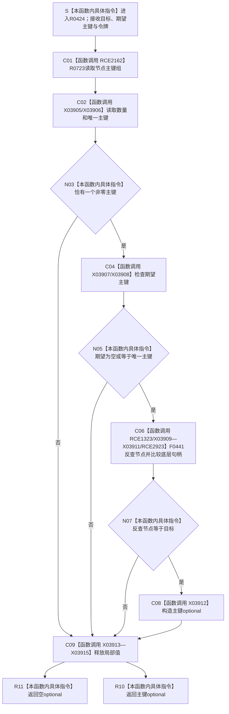

# CF-L11-0083 读取唯一主键已许可现状流程图

图类型：现状流程图
代码版本：`3920a74638264f9f539d50f32f3c9fe5fb1982ab`
当前工作区复核基线：`7951b1bea78c7338643ab18428180d521e4d5a62`
源码 blob：`fdc9a1b062b28feffec733dd1a0e342812ef1ddc`
覆盖文件：`海中鱼巣/领域/数据操作.轻量因果.ixx:201-212`
唯一根函数：R0424
完整签名：`std::optional<std::uint64_t> 海中鱼巣::轻量因果数据操作::读取唯一主键_已许可(海中鱼巣::节点句柄 目标, std::optional<std::uint64_t> 期望主键, const 海中鱼巣::结构事务令牌& 令牌) const`
参数：隐式 `this` 为 const 数据操作非拥有借用；`目标` 与 `期望主键` 按值传入；`令牌` 为调用期 const 引用，本函数不保存
返回结果：只有目标恰好绑定一个非零主键、期望主键为空或匹配，且主键反查节点与目标相等时返回该主键；其它分支返回 `std::nullopt`
调用方：R0425 经 RCE1325
直接项目函数：RCE1323、RCE2162、RCE2923
符号外部边界：X03905—X03915
调用图：`流程图/主程序可达调用关系/01_main可达项目调用边表.md`
外部边界表：`流程图/主程序可达调用关系/02_main可达外部边界表.md`
逐行映射表：`流程图/代码流程图/L11/CF-L11-0083_读取唯一主键已许可_逐行代码映射表.md`
输入契约 / 调用语境表：本文“读取语境与非成功分账”
非成功返回二分审查表：本文“读取语境与非成功分账”
偏差清单：本文“当前边界与规范核对”
依据提交 / 结构化消息：冻结源码提交 `3920a74638264f9f539d50f32f3c9fe5fb1982ab`；在当前 `main` 基线 `7951b1bea78c7338643ab18428180d521e4d5a62` 复核目标源码零差异
验证输出：12 行源码完整映射；3 个项目出边、11 个外部边界、0 个未解析项目调用；本切片不运行构建或程序
依据：`规范/0050_项目通用机器逻辑与禁止性规则总纲_20260721.md`、`规范/0600_代码函数流程图应用与维护规范.md`、`规范/1190_根规范_因果_20260720.md`、`规范/4010_子规范_统一仓库稳定句柄与通用关系索引边界.md`、`规范/4050_子规范_入口拒绝逻辑内结果与内部逻辑错误.md`
不得作为施工许可：是
不得宣称：返回主键证明轻量因果已经成为完整因果事实、空 optional 唯一证明目标不存在、令牌有效性由本函数重新裁决，或只读校验修改了节点 / 索引结构

## 流程图

## 项目源码调用合同

| 调用边 | 节点 | 被调函数 | 实参与结果 |
| --- | --- | --- | --- |
| RCE2162 | C01 | R0723 `索引仓库::读取节点主键组(...) const` | `目标`、`令牌`；返回主键 vector |
| RCE1323 | C06 | F0441 `索引仓库::按主键查节点(...) const` | 唯一主键、`令牌`；返回节点 optional |
| RCE2923 | C06 | F0051 `operator==(const 节点句柄&, const 节点句柄&)` | optional 不等比较内部以反查句柄和 `目标` 完成底层相等比较 |

## 外部边界

| 边界 | 调用点 | 静态调用 | 次数 |
| --- | --- | --- | --- |
| X03905 | 206 | `std::vector<std::uint64_t>::size() const noexcept` | 1 |
| X03906 | 206、207、208、211 | `const std::uint64_t& std::vector<std::uint64_t>::front() const` | 4 |
| X03907 | 207 | `bool std::optional<std::uint64_t>::has_value() const noexcept` | 1 |
| X03908 | 207 | `std::uint64_t& std::optional<std::uint64_t>::operator*() & noexcept` | 1 |
| X03909 | 208 | `std::optional<海中鱼巣::节点句柄>::optional(const 海中鱼巣::节点句柄&)` | 1 |
| X03910 | 208 | `bool std::operator!=(const std::optional<海中鱼巣::节点句柄>&, const std::optional<海中鱼巣::节点句柄>&)` | 1 |
| X03911 | 208 | `std::optional<海中鱼巣::节点句柄>::~optional()` | 1 |
| X03912 | 211 | `std::optional<std::uint64_t>::optional(const std::uint64_t&)` | 1 |
| X03913 | 205-212 | `std::vector<std::uint64_t>::~vector()` | 1 |
| X03914 | 201-212 | `std::optional<std::uint64_t>::~optional()` | 1 |
| X03915 | 206、207、209 | `std::optional<std::uint64_t>::optional(std::nullopt_t) noexcept` | 3 |

## 读取语境与非成功分账

| 节点 | 返回条件 | 二分口径 | 结构变化 |
| --- | --- | --- | --- |
| N03 / R11 | 主键数量不为一或唯一主键为零 | 当前封闭读取辅助的空结果；上游保证唯一绑定时为待核内部差异 | 无 |
| N05 / R11 | 期望主键有值且与唯一主键不同 | 版本 / 身份不匹配的逻辑内空结果 | 无 |
| N07 / R11 | 主键反查节点与目标不同 | 正反索引不一致；强前置成立时应追根因 | 无 |
| R10 | 全部复核通过 | 正常值式读取 | 无 |

## 当前边界与规范核对

- 本函数与已发布 R0347 同构；X03905—X03915 按相同静态类型和生命周期口径平移。
- 208 行 optional 节点句柄不等比较隐含的底层句柄相等调用由 RCE2923 指向 F0051。
- 本函数只复核节点与稳定主键索引的双向一致性，不发布索引或因果事实。
- 本图登记当前代码事实，不修改共享关系表，也不把 RCE2923 / X03905—X03915 写成已发布聚合事实。
