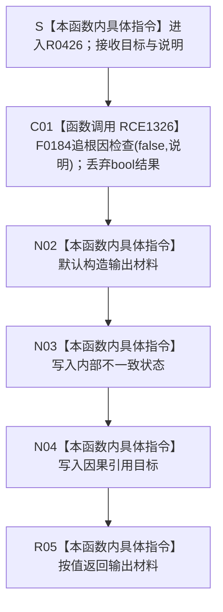

# CF-L11-0084 因果内部不一致现状流程图

图类型：现状流程图
代码版本：`3920a74638264f9f539d50f32f3c9fe5fb1982ab`
当前工作区复核基线：`7951b1bea78c7338643ab18428180d521e4d5a62`
源码 blob：`fdc9a1b062b28feffec733dd1a0e342812ef1ddc`
覆盖文件：`海中鱼巣/领域/数据操作.轻量因果.ixx:242-248`
唯一根函数：R0426
完整签名：`static 海中鱼巣::轻量因果值式材料 海中鱼巣::轻量因果数据操作::因果内部不一致(海中鱼巣::节点句柄 目标, const wchar_t* 说明)`
参数：`目标` 按值传入；`说明` 为调用期只读宽字符串指针，只交给 F0184 做人读诊断且不保存
返回结果：始终返回状态为 `内部不一致`、因果引用为 `目标` 的 `轻量因果值式材料`；F0184 的 bool 返回被显式丢弃
调用方：R0425 经 RCE1324，调用点 230、234
直接项目函数：RCE1326
符号外部边界：无
调用图：`流程图/主程序可达调用关系/01_main可达项目调用边表.md`
外部边界表：`流程图/主程序可达调用关系/02_main可达外部边界表.md`
逐行映射表：`流程图/代码流程图/L11/CF-L11-0084_因果内部不一致_逐行代码映射表.md`
输入契约 / 调用语境表：本文“内部错误语境”
非成功返回二分审查表：本文“内部错误语境”
偏差清单：本文“当前边界与规范核对”
依据提交 / 结构化消息：冻结源码提交 `3920a74638264f9f539d50f32f3c9fe5fb1982ab`；在当前 `main` 基线 `7951b1bea78c7338643ab18428180d521e4d5a62` 复核目标源码零差异
验证输出：7 行源码完整映射；1 个项目出边、0 个外部边界、0 个未解析项目调用；本切片不运行构建或程序
依据：`规范/0050_项目通用机器逻辑与禁止性规则总纲_20260721.md`、`规范/0600_代码函数流程图应用与维护规范.md`、`规范/1190_根规范_因果_20260720.md`、`规范/4050_子规范_入口拒绝逻辑内结果与内部逻辑错误.md`
不得作为施工许可：是
不得宣称：诊断调用修复了缺失结构、返回内部不一致材料形成了新的因果事实、依赖路径可以忽略该结果继续，或本函数修改了节点、主信息、索引或因果结构

## 流程图

## 项目源码调用合同

| 调用边 | 节点 | 被调函数 | 实参与结果 |
| --- | --- | --- | --- |
| RCE1326 | C01 | F0184 `bool 追根因检查(bool 条件,const wchar_t* 说明)` | 固定 `false` 与调用方说明；bool 结果显式转为 `void` |

## 内部错误语境

| 调用点 | R0425 已通过前置 | 当前不一致 | 二分口径 | 结构变化 |
| --- | --- | --- | --- | --- |
| 230 | 目标节点记录存在且类型为因果引用 | 节点记录所指主信息当前不可读 | 内部逻辑错误，追根因解决 | 无 |
| 234 | 目标节点记录、类型和主信息均可读 | 没有唯一非零且双向一致的主键 | 内部逻辑错误，追根因解决 | 无 |

## 当前边界与规范核对

- F0184 只产生人读诊断；其返回值被丢弃，不能改变 R0426 的机器结果或修复结构。
- R0426 用强类型状态把内部不一致与入口拒绝、许可拒绝、未找到和版本漂移分开。
- 返回材料只描述本次读取失败，不是新的长期因果事实；1190 规定轻量因果引用本身也不等于完整稳定因果结论。
