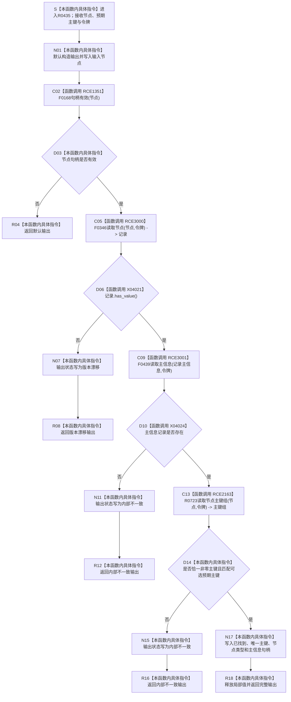

# CF-L11-0085 读取身份已许可现状流程图

图类型：现状流程图
代码版本：`3920a74638264f9f539d50f32f3c9fe5fb1982ab`
当前工作区复核基线：`fe2ca0c3e7b8f734053b87b96de65ea0f2e57b67`
源码 blob：`16ac9534baeda26ac8a712066e713f3339f6e0c8`
覆盖文件：`海中鱼巣/领域/数据操作.需求任务方法.ixx:1934-1961`
唯一根函数：R0435
完整签名：`海中鱼巣::高级节点身份 海中鱼巣::需求任务方法数据操作::读取身份_已许可(海中鱼巣::节点句柄 节点, std::optional<std::uint64_t> 预期主键, const 海中鱼巣::结构事务令牌& 令牌) const`
参数：`节点`、`预期主键` 按值传入；`令牌` 为调用期只读借用
返回结果：返回值式 `高级节点身份`；无效句柄保持默认状态，节点版本漂移返回 `版本漂移`，主信息或主键结构异常返回 `内部不一致`，完整读回返回 `已找到`
调用方：R0440、R0441、R0442、R0444、R0446、R0447、R0448、R0450
直接项目函数：F0168（RCE1351）、R0723（RCE2163）、F0346（RCE3000）、F0439（RCE3001）
符号外部边界：X04021—X04031
调用图：`流程图/主程序可达调用关系/01_main可达项目调用边表.md`
外部边界表：`流程图/主程序可达调用关系/02_main可达外部边界表.md`
逐行映射表：`流程图/代码流程图/L11/CF-L11-0085_读取身份已许可_逐行代码映射表.md`
输入契约 / 调用语境表：本文“读取语境”
非成功返回二分审查表：本文“读取语境”
偏差清单：本文“当前边界与规范核对”
依据提交 / 结构化消息：冻结源码提交 `3920a74638264f9f539d50f32f3c9fe5fb1982ab`；当前 `main` 复核目标源码零差异
验证输出：28 行源码完整映射；4 个项目出边、11 个外部边界、0 个未解析项目调用；本切片不运行构建或程序
依据：`规范/0050_项目通用机器逻辑与禁止性规则总纲_20260721.md`、`规范/0600_代码函数流程图应用与维护规范.md`、`规范/4010_子规范_统一仓库稳定句柄与通用关系索引边界.md`、`规范/4050_子规范_入口拒绝逻辑内结果与内部逻辑错误.md`
不得作为施工许可：是
不得宣称：返回材料已形成新的身份事实、索引命中可替代节点与主信息回读、内部不一致已被修复，或本函数写入了节点、主信息、关系或索引

## 流程图

## 稳定调用合同

| 边界 | 调用点 | 完整调用 |
| --- | --- | --- |
| RCE1351 | 1940 | F0168 `bool 句柄有效(节点句柄)` |
| RCE3000 | 1941 | F0346 `节点仓库::读取节点(节点句柄,const 结构事务令牌&) const` |
| RCE3001 | 1946 | F0439 `主信息仓库::读取主信息(主信息句柄,const 结构事务令牌&) const` |
| RCE2163 | 1950 | R0723 `索引仓库::读取节点主键组(节点句柄,const 结构事务令牌&) const` |
| X04021—X04023 | 1942、1946、1958—1961 | `optional<节点记录>` 的 `has_value`、`operator-> const`、析构 |
| X04024—X04025 | 1946 | `optional<主信息记录>` 的 `has_value`、析构 |
| X04026—X04028 | 1951—1957、1960—1961 | `vector<uint64_t>` 的 `size`、`front const`、析构 |
| X04029—X04031 | 1952、1960—1961 | `optional<uint64_t>` 的 `has_value`、`operator* const`、析构 |

## 读取语境

| 分支 | 当前事实 | 口径 | 结构变化 |
| --- | --- | --- | --- |
| 无效节点句柄 | 调用方提交的读取身份无效 | 入口拒绝式只读结果 | 无 |
| 节点记录不存在 | 输入句柄不能回读当前节点版本 | 版本漂移，逻辑内返回 | 无 |
| 主信息不存在或主键结构异常 | 节点已经回读，但内部组成不闭合 | 内部逻辑错误，追根因解决 | 无 |
| 完整读回 | 节点、主信息和唯一主键相互闭合 | 成功读取 | 只形成临时值式输出 |

## 当前边界与规范核对

- 索引主键组只用于定位和互证；成功必须同时回读当前节点记录与主信息记录。
- 节点记录已存在后的主信息缺失、主键重复、零主键或预期主键异义均被分到账为内部不一致。
- 本函数全程只读，返回值不是新的长期身份事实。
