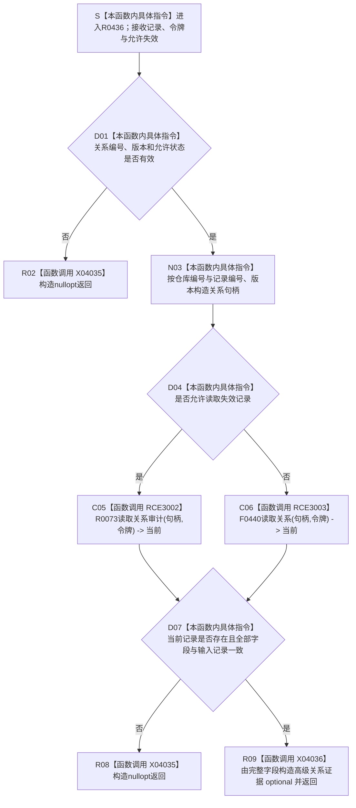

# CF-L11-0086 形成关系证据已许可现状流程图

图类型：现状流程图
代码版本：`3920a74638264f9f539d50f32f3c9fe5fb1982ab`
当前工作区复核基线：`fe2ca0c3e7b8f734053b87b96de65ea0f2e57b67`
源码 blob：`16ac9534baeda26ac8a712066e713f3339f6e0c8`
覆盖文件：`海中鱼巣/领域/数据操作.需求任务方法.ixx:1963-1980`
唯一根函数：R0436
完整签名：`std::optional<海中鱼巣::高级关系证据> 海中鱼巣::需求任务方法数据操作::形成关系证据_已许可(const 海中鱼巣::关系记录& 记录, const 海中鱼巣::结构事务令牌& 令牌, bool 允许失效 = false) const`
参数：`记录`、`令牌` 为调用期只读借用；`允许失效` 按值传入
返回结果：记录身份或当前审计回读不闭合时返回 `std::nullopt`；闭合时返回值式 `高级关系证据`
调用方：R0440、R0441、R0442、R0444、R0446、R0448
直接项目函数：R0073（RCE3002）、F0440（RCE3003）
符号外部边界：X04032—X04036
调用图：`流程图/主程序可达调用关系/01_main可达项目调用边表.md`
外部边界表：`流程图/主程序可达调用关系/02_main可达外部边界表.md`
逐行映射表：`流程图/代码流程图/L11/CF-L11-0086_形成关系证据已许可_逐行代码映射表.md`
输入契约 / 调用语境表：本文“读取语境”
非成功返回二分审查表：本文“读取语境”
偏差清单：本文“当前边界与规范核对”
依据提交 / 结构化消息：冻结源码提交 `3920a74638264f9f539d50f32f3c9fe5fb1982ab`；当前 `main` 复核目标源码零差异
验证输出：18 行源码完整映射；2 个项目出边、5 个外部边界、0 个未解析项目调用；本切片不运行构建或程序
依据：`规范/0050_项目通用机器逻辑与禁止性规则总纲_20260721.md`、`规范/0600_代码函数流程图应用与维护规范.md`、`规范/4010_子规范_统一仓库稳定句柄与通用关系索引边界.md`、`规范/4050_子规范_入口拒绝逻辑内结果与内部逻辑错误.md`
不得作为施工许可：是
不得宣称：审计材料可进入普通业务裁决、空 optional 已修复关系结构、返回证据发布了新关系，或本函数修改了关系状态

## 流程图

## 稳定调用合同

| 边界 | 调用点 | 完整调用 |
| --- | --- | --- |
| RCE3002 | 1971 | R0073 `关系仓库::读取关系审计(关系句柄,const 结构事务令牌&) const` |
| RCE3003 | 1972 | F0440 `关系仓库::读取关系(关系句柄,const 结构事务令牌&) const` |
| X04032—X04034 | 1970—1976、1980 | `optional<关系记录>` 的 `has_value`、`operator-> const`、析构 |
| X04035 | 1968、1976 | `optional<高级关系证据>::optional(std::nullopt_t)` |
| X04036 | 1977—1979 | `optional<高级关系证据>::optional(高级关系证据&&)` |

## 读取语境

| 分支 | 口径 | 结构变化 |
| --- | --- | --- |
| 零关系编号、零版本或不允许的失效状态 | 入口材料拒绝式空结果 | 无 |
| 仓库当前 / 审计记录不存在或字段不一致 | 只读空结果；调用方按自身契约决定内部不一致 | 无 |
| 完整一致 | 返回非持久值式证据 | 无 |

## 当前边界与规范核对

- 普通读取与审计读取按 `允许失效` 分流，审计结果不自动进入普通当前事实。
- 输入记录与仓库回读逐字段一致后才形成证据，未以调用成功或句柄非零代替结构复核。
- 本函数只构造值式投影，不写关系仓库。
