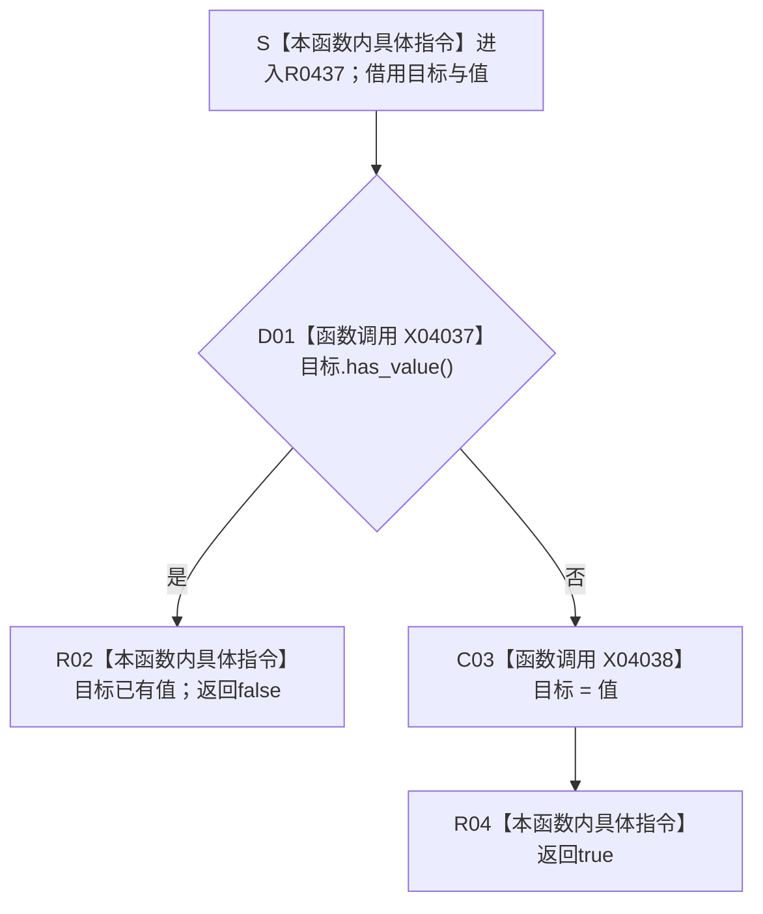

# CF-L11-0087 设置唯一关系现状流程图

图类型：现状流程图
代码版本：`3920a74638264f9f539d50f32f3c9fe5fb1982ab`
当前工作区复核基线：`fe2ca0c3e7b8f734053b87b96de65ea0f2e57b67`
源码 blob：`16ac9534baeda26ac8a712066e713f3339f6e0c8`
覆盖文件：`海中鱼巣/领域/数据操作.需求任务方法.ixx:1982-1988`
唯一根函数：R0437
完整签名：`static bool 海中鱼巣::需求任务方法数据操作::设置唯一关系(std::optional<海中鱼巣::高级关系证据>& 目标, const 海中鱼巣::高级关系证据& 值) noexcept`
参数：`目标` 为调用方拥有的可写 optional 引用；`值` 为调用期只读借用
返回结果：目标已有值时返回 false 且不改写；目标为空时复制赋值并返回 true
调用方：R0440、R0441、R0442、R0444、R0448
直接项目函数：无
符号外部边界：X04037—X04038
逐行映射表：`流程图/代码流程图/L11/CF-L11-0087_设置唯一关系_逐行代码映射表.md`
依据提交 / 结构化消息：冻结源码提交 `3920a74638264f9f539d50f32f3c9fe5fb1982ab`；当前 `main` 复核目标源码零差异
验证输出：7 行源码完整映射；0 个项目出边、2 个外部边界、0 个未解析项目调用；本切片不运行构建或程序
依据：`规范/0050_项目通用机器逻辑与禁止性规则总纲_20260721.md`、`规范/0600_代码函数流程图应用与维护规范.md`、`规范/4010_子规范_统一仓库稳定句柄与通用关系索引边界.md`
不得作为施工许可：是
不得宣称：true 证明关系已写入仓库、false 是普通可忽略重复，或该局部唯一性检查替代正式关系基数合同

## 流程图

## 当前边界与规范核对

- 本函数只维护调用期 optional 的“至多一项”局部约束，不修改关系仓库。
- 调用方在前置已通过的正式结构读取中遇到 false 时，均把重复关系收口为内部不一致。
