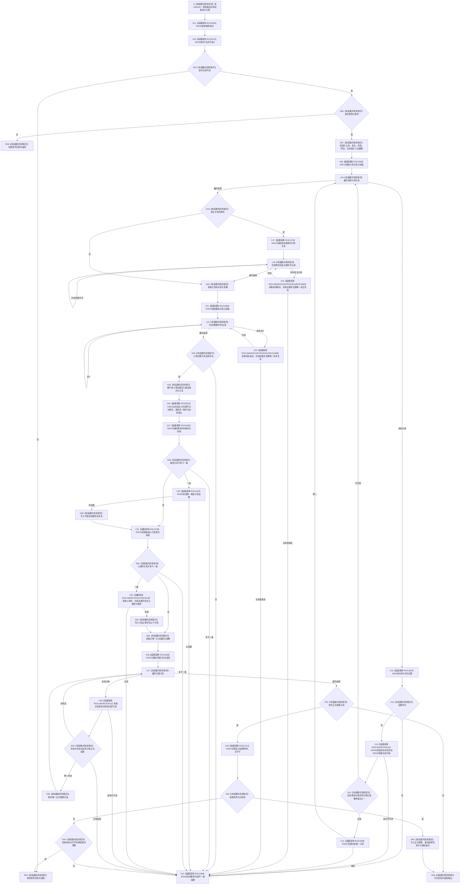

# CF-L11-0088 读取需求已许可现状流程图

图类型：现状流程图
代码版本：`3920a74638264f9f539d50f32f3c9fe5fb1982ab`
当前工作区复核基线：`57866ac5ca63235ed12da60f635d29f1aacd718b`
源码 blob：`16ac9534baeda26ac8a712066e713f3339f6e0c8`
覆盖文件：`海中鱼巣/领域/数据操作.需求任务方法.ixx:2184-2306`
唯一根函数：R0442
完整签名：`海中鱼巣::需求权威材料 海中鱼巣::需求任务方法数据操作::读取需求_已许可(海中鱼巣::节点句柄 需求, const 海中鱼巣::结构事务令牌& 令牌) const`
参数：`需求` 按值传入；`令牌` 为调用期只读借用
返回结果：身份不可读时透传读取状态；类型错误时返回类型不匹配；必需关系、可选关系唯一性或正式结算材料不一致时返回内部不一致；结算读取许可拒绝或版本漂移时透传该状态；结构齐全时返回已找到的需求权威材料
调用方：已登记 R0442 直接调用方
直接项目函数：R0435（RCE1365）、R0078（RCE1366）、R0436（RCE1367）、R0443（RCE1368）、R0437（RCE1369）、R0079（RCE1370）、R0441（RCE1371）、R0428（RCE3012）、F0051（RCE3013）
符号外部边界：X04069—X04088
逐行映射表：`流程图/代码流程图/L11/CF-L11-0088_读取需求已许可_逐行代码映射表.md`
依据提交 / 结构化消息：冻结源码提交 `3920a74638264f9f539d50f32f3c9fe5fb1982ab`；当前 `main` 复核目标源码零差异
验证输出：123 行源码完整映射；9 个项目出边、20 个外部边界、0 个未解析项目调用；本切片不运行构建或程序
依据：`规范/0050_项目通用机器逻辑与禁止性规则总纲_20260721.md`、`规范/0600_代码函数流程图应用与维护规范.md`
不得作为施工许可：是
不得宣称：读取成功等于需求已结算或能力完成、内部不一致已经修复，或本函数写入了需求、关系、状态、主信息或索引

## 流程图

## 当前边界与规范核对

- 本函数只聚合当前需求端点、可选概念/父需求和可选正式结算材料，不创建、更新或发布这些事实。
- 身份许可拒绝、版本漂移和类型不匹配是具名逻辑内结果；通过身份前置后的关系缺失、重复或端点错误归为内部不一致。
