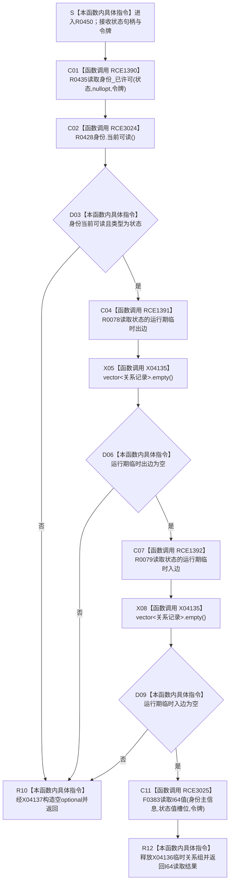

# CF-L11-0090 读取抽象状态值已许可现状流程图

图类型：现状流程图
代码版本：`3920a74638264f9f539d50f32f3c9fe5fb1982ab`
当前工作区复核基线：`57866ac5ca63235ed12da60f635d29f1aacd718b`
源码 blob：`16ac9534baeda26ac8a712066e713f3339f6e0c8`
覆盖文件：`海中鱼巣/领域/数据操作.需求任务方法.ixx:2756-2766`
唯一根函数：R0450
完整签名：`std::optional<std::int64_t> 海中鱼巣::需求任务方法数据操作::读取抽象状态值_已许可(海中鱼巣::节点句柄 状态, const 海中鱼巣::结构事务令牌& 令牌) const`
参数：`状态` 按值传入；`令牌` 为调用期只读借用
返回结果：身份不可读、类型不为状态或存在任一运行期临时关系时返回空 optional；否则返回状态主信息 I64 槽位读取结果
调用方：R0448（RCE1387）
直接项目函数：R0435（RCE1390）、R0428（RCE3024）、R0078（RCE1391）、R0079（RCE1392）、F0383（RCE3025）
符号外部边界：X04135—X04137
逐行映射表：`流程图/代码流程图/L11/CF-L11-0090_读取抽象状态值已许可_逐行代码映射表.md`
依据提交 / 结构化消息：冻结源码提交 `3920a74638264f9f539d50f32f3c9fe5fb1982ab`；当前 `main` 复核目标源码零差异
验证输出：11 行源码完整映射；5 个项目出边、3 个外部边界、0 个未解析项目调用；本切片不运行构建或程序
依据：`规范/0050_项目通用机器逻辑与禁止性规则总纲_20260721.md`、`规范/0600_代码函数流程图应用与维护规范.md`、`规范/1160_根规范_状态节点_20260720.md`、`规范/4020_子规范_领域类型化数据记录与组合读取投影边界.md`
不得作为施工许可：是
不得宣称：返回 I64 本身就是完整状态事实、空 optional 已修复内部结构，或本函数写入了状态、关系、主信息或索引

## 流程图

## 当前边界与规范核对

- 本函数拒绝任何带运行期临时关系的状态节点，避免把临时结构读成抽象长期状态值。
- 成功结果仍只是一个主信息槽位值，调用方必须结合身份、关系和规则语境解释。
