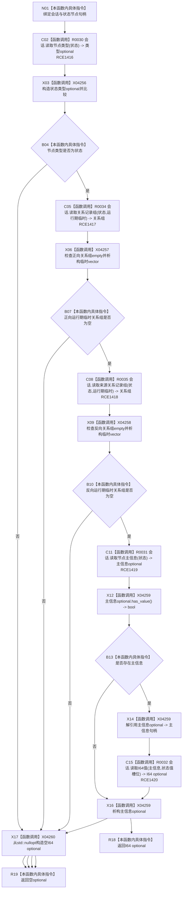

# CF-L11-0091 读取会话抽象状态值现状流程图

图类型：现状流程图
代码版本：`3920a74638264f9f539d50f32f3c9fe5fb1982ab`
源码 blob：`16ac9534baeda26ac8a712066e713f3339f6e0c8`
当前工作区复核基线：`af74e46ef3fd0b1b2c108d695569855909a59ee1`
覆盖文件：`海中鱼巣/领域/数据操作.需求任务方法.ixx:3145-3153`
唯一根函数：R0457
完整签名：`std::optional<std::int64_t> 海中鱼巣::需求任务方法数据操作::读取会话抽象状态值(结构写入会话& 会话, 节点句柄 状态) const`
参数：`会话` 为可变借用但本函数只调用读取接口；`状态` 按值传入
返回结果：状态节点类型正确、没有运行期临时出入关系且存在主信息时返回 I64 状态值 optional；否则返回 `std::nullopt`
已登记调用方：R0458（RCE1423）
直接项目函数：R0030（RCE1416）、R0034（RCE1417）、R0035（RCE1418）、R0031（RCE1419）、R0032（RCE1420）
外部边界：X04256—X04260
逐行映射表：`流程图/代码流程图/L11/CF-L11-0091_读取会话抽象状态值_逐行代码映射表.md`
结构读写：只读会话候选中的节点类型、关系组、主信息绑定和 I64 值；不请求提交
依据提交 / 结构化消息：当前维护基线 `57866ac5ca63235ed12da60f635d29f1aacd718b`；冻结源码提交 `3920a74638264f9f539d50f32f3c9fe5fb1982ab`
不得作为施工许可：是
不得宣称：返回值表示状态节点已经发布或仍对普通读取可见

## 流程图

## 当前边界

- 两次关系读取只检查 `运行期临时` 关系组为空，不检查其它关系类型。
- 主信息缺失与端点不满足均按当前实现返回空 optional。
