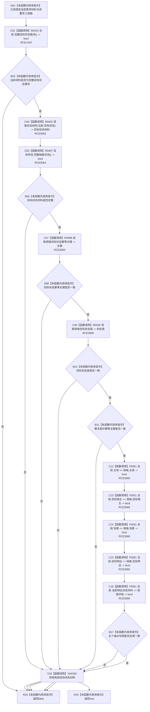

# CF-L11-0092 完整需求匹配现状流程图

图类型：现状流程图
代码版本：`3920a74638264f9f539d50f32f3c9fe5fb1982ab`
源码 blob：`16ac9534baeda26ac8a712066e713f3339f6e0c8`
当前工作区复核基线：`57866ac5ca63235ed12da60f635d29f1aacd718b`
覆盖文件：`海中鱼巣/领域/数据操作.需求任务方法.ixx:3379-3391`
唯一根函数：R0459
完整签名：`bool 海中鱼巣::需求任务方法数据操作::完整需求匹配(const 需求权威材料& 当前, const 完整需求写入规格& 规格) const`
参数：`当前`、`规格` 均为只读借用
返回结果：当前材料完整，目标状态值式材料与规格一致，需求主键和五个端点句柄一致时返回 `true`，否则返回 `false`
已登记调用方：R0454（RCE1402）
直接项目函数：R0434（RCE1424）、R0402（RCE3063）、R0407（RCE3064）、R0399（RCE3065）、R0400（RCE3066）、F0051（RCE3069）
外部边界：X04263（局部状态值式材料生命周期）
逐行映射表：`流程图/代码流程图/L11/CF-L11-0092_完整需求匹配_逐行代码映射表.md`
结构读写：读取当前需求材料与当前目标状态材料；不写机器结构
依据提交 / 结构化消息：当前维护基线 `57866ac5ca63235ed12da60f635d29f1aacd718b`；冻结源码提交 `3920a74638264f9f539d50f32f3c9fe5fb1982ab`
不得作为施工许可：是
不得宣称：匹配成功表示相关结构在后续事务中不会发生版本变化

## 流程图

## 当前边界

- RCE3063—RCE3066 补齐此前聚合中遗漏的状态材料读取与规格访问调用。
- RCE3069 记录五次节点句柄相等比较；本函数不比较关系证据版本。
