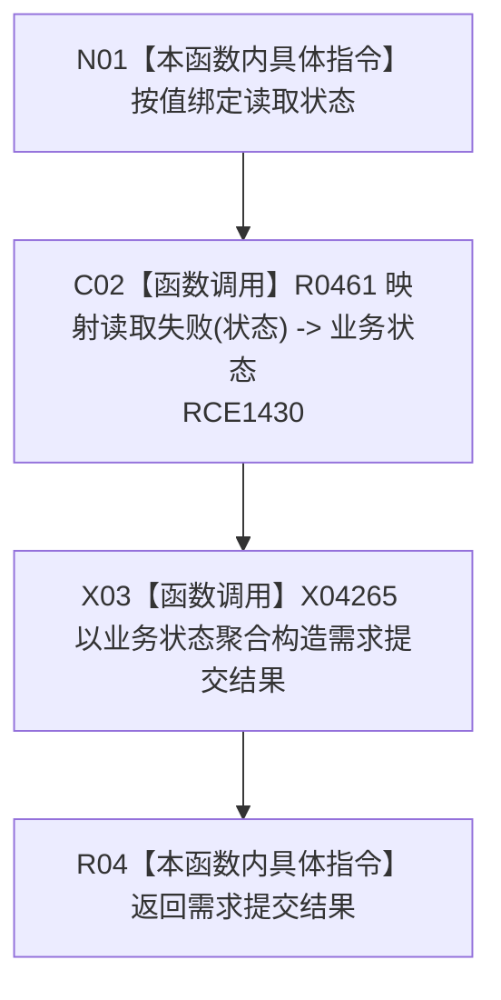

# CF-L11-0093 从需求读取失败现状流程图

图类型：现状流程图
代码版本：`3920a74638264f9f539d50f32f3c9fe5fb1982ab`
源码 blob：`16ac9534baeda26ac8a712066e713f3339f6e0c8`
当前工作区复核基线：`57866ac5ca63235ed12da60f635d29f1aacd718b`
覆盖文件：`海中鱼巣/领域/数据操作.需求任务方法.ixx:3590-3592`
唯一根函数：R0463
完整签名：`static 需求提交结果 海中鱼巣::需求任务方法数据操作::从需求读取失败(需求任务方法读取状态 状态) noexcept`
参数：`状态` 按值传入
返回结果：把 R0461 映射出的业务状态装入 `需求提交结果` 并返回
已登记调用方：R0454（RCE1403）
直接项目函数：R0461（RCE1430）
外部边界：X04265（需求提交结果聚合构造与返回生命周期）
逐行映射表：`流程图/代码流程图/L11/CF-L11-0093_从需求读取失败_逐行代码映射表.md`
结构读写：只转换枚举并形成返回 DTO；无机器结构变化
依据提交 / 结构化消息：当前维护基线 `57866ac5ca63235ed12da60f635d29f1aacd718b`；冻结源码提交 `3920a74638264f9f539d50f32f3c9fe5fb1982ab`
不得作为施工许可：是
不得宣称：返回 DTO 表示失败根因已经解决

## 流程图

## 当前边界

- 本函数不附加需求权威材料，只保留映射后的业务状态。
