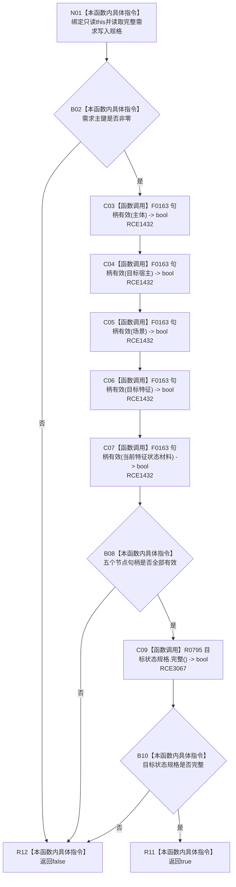

# CF-L11-0095 完整需求写入规格完整现状流程图

图类型：现状流程图
代码版本：`3920a74638264f9f539d50f32f3c9fe5fb1982ab`
源码 blob：`16ac9534baeda26ac8a712066e713f3339f6e0c8`
当前工作区复核基线：`57866ac5ca63235ed12da60f635d29f1aacd718b`
覆盖文件：`海中鱼巣/领域/数据操作.需求任务方法.ixx:448-452`
唯一根函数：R0466
完整签名：`bool 海中鱼巣::完整需求写入规格::完整() const noexcept`
参数：无显式参数；隐式 `this` 为只读借用
返回结果：需求主键非零、五个节点句柄有效且目标状态规格完整时返回 `true`，否则返回 `false`
已登记调用方：R0454、R0467（RCE1400、校正后的 RCE1433）
直接项目函数：F0163（校正后的 RCE1432）、R0795（RCE3067）
外部边界：无
逐行映射表：`流程图/代码流程图/L11/CF-L11-0095_完整需求写入规格完整_逐行代码映射表.md`
结构读写：只读取写入规格字段；不访问仓库，不写机器结构
依据提交 / 结构化消息：当前维护基线 `57866ac5ca63235ed12da60f635d29f1aacd718b`；冻结源码提交 `3920a74638264f9f539d50f32f3c9fe5fb1982ab`
不得作为施工许可：是
不得宣称：规格完整表示需求或目标状态已经写入

## 流程图

## 当前边界

- 原 RCE1432 误绑关系句柄重载 F0168；五个实参静态类型均为节点句柄，本批校正为 F0163。
- RCE3067 补登记目标状态规格完整性调用；本函数不读取任何仓库事实。
