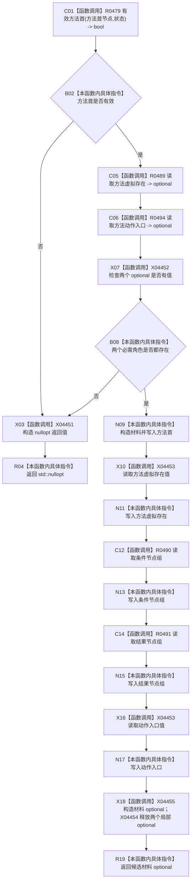

# CF-L11-0096 方法服务读取方法候选材料现状流程图

代码版本：`3920a74638264f9f539d50f32f3c9fe5fb1982ab`
当前工作区复核基线：`af74e46ef3fd0b1b2c108d695569855909a59ee1`
源码 blob：`839dd462c70e8d54b6f22f1126d751ac9425398a`
图类型：现状流程图
覆盖文件：`海中鱼巣/领域/方法服务.h:1008-1024`
唯一根函数：R0468
完整签名：`std::optional<方法候选材料> 海中鱼巣::方法服务::读取方法候选材料(节点句柄 方法首节点, const 状态服务& 状态) const`
参数：`方法首节点` 值传入；`状态` 只读借用
返回结果：完整候选材料 optional；任一前置或必需角色缺失返回 `std::nullopt`
已登记调用方：R0290
直接项目函数：R0479（RCE1434）、R0489（RCE1435）、R0494（RCE1436）、R0490（RCE1437）、R0491（RCE1438）
稳定外部边界：X04451—X04455
逐行映射表：`流程图/代码流程图/L11/CF-L11-0096_方法服务读取方法候选材料_逐行代码映射表.md`
依据提交 / 结构化消息：冻结源码、当前身份表、既有项目边与本批源码逐行复核
验证输出：本批只读源码并生成当前事实图；不运行构建或程序
不得作为施工许可：是
不得宣称：候选材料读取已满足目标设计或能力已经完成

## 节点合同

| 节点 | 类型 | 输入 / 参数绑定 | 输出 / 后继 |
| --- | --- | --- | --- |
| C01 | 函数调用 | 方法首节点、状态 | 有效性 bool |
| B02 | 本函数内具体指令 | 有效性 bool | 无效走 X03；有效走 C05 |
| X03 / R04 | 函数调用 / 本函数内具体指令 | 无候选 | 构造并返回空 optional |
| C05 / C06 | 函数调用 | 方法首节点、状态 | 两个必需角色 optional |
| X07 / B08 | 函数调用 / 本函数内具体指令 | 两个 optional | 缺一即空返回 |
| N09—N17 | 本函数内具体指令 / 函数调用 | 已确认角色与两组节点 | 逐字段形成局部材料 |
| X18 / R19 | 函数调用 / 本函数内具体指令 | 完整局部材料 | 返回材料 optional 并释放局部 optional |

## 关键边界

- 本函数只读并组装值式候选，不写节点、关系、索引或状态。
- `R0479`、R0489—R0491、R0494 均有非平凡内部过程，应由各自单函数图展开。
- 空 optional 是普通候选读取的逻辑内返回；它不证明底层结构正确。
