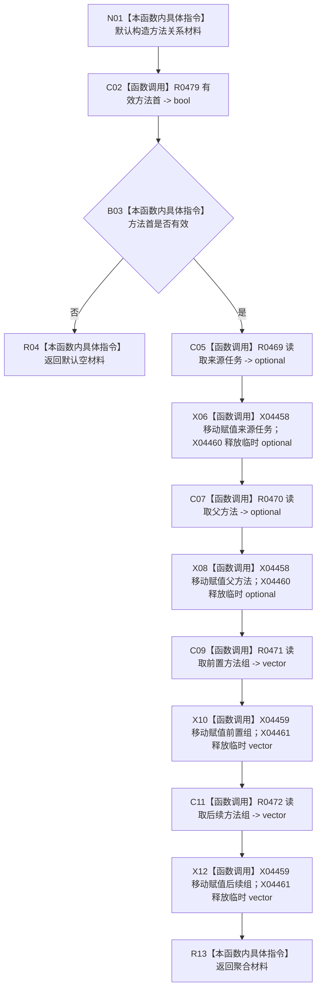

# CF-L11-0097 方法服务读取方法关系材料现状流程图

代码版本：`3920a74638264f9f539d50f32f3c9fe5fb1982ab`
当前工作区复核基线：`57866ac5ca63235ed12da60f635d29f1aacd718b`
源码 blob：`839dd462c70e8d54b6f22f1126d751ac9425398a`
图类型：现状流程图
覆盖文件：`海中鱼巣/领域/方法服务.h:1095-1105`
唯一根函数：R0473
完整签名：`方法关系材料 海中鱼巣::方法服务::读取方法关系材料(节点句柄 方法首节点, const 状态服务& 状态) const`
参数：方法首节点值传入；状态只读借用
返回结果：值式方法关系材料；方法首无效时返回默认空材料
已登记调用方：R0290
直接项目函数：R0479（RCE1445）、R0469（RCE1446）、R0470（RCE1447）、R0471（RCE1448）、R0472（RCE1449）
本批外部边界建议：X04458—X04461
逐行映射表：`流程图/代码流程图/L11/CF-L11-0097_方法服务读取方法关系材料_逐行代码映射表.md`
不得作为施工许可：是
不得宣称：聚合关系材料已经满足目标设计或能力完成

## 节点合同

| 节点 | 类型 | 输入 | 输出 / 后继 |
| --- | --- | --- | --- |
| N01 | 本函数内具体指令 | 无 | 默认空材料 |
| C02 / B03 | 函数调用 / 本函数内具体指令 | 方法首节点、状态 | 无效返回；有效继续 |
| C05 / X06 | 函数调用 | 来源任务结果 | 移入字段并释放临时量 |
| C07 / X08 | 函数调用 | 父方法结果 | 移入字段并释放临时量 |
| C09 / X10 | 函数调用 | 前置组结果 | 移入字段并释放临时量 |
| C11 / X12 | 函数调用 | 后续组结果 | 移入字段并释放临时量 |
| R04 / R13 | 本函数内具体指令 | 默认或聚合材料 | 值式返回 |

## 关键边界

- 本函数只聚合四个只读结果，不判断材料完整性。
- 默认空材料和字段空值是普通只读投影结果；不能据此证明关系结构正确。
