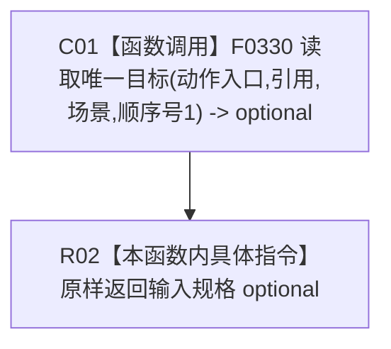

# CF-L11-0098 方法服务读取动作输入规格现状流程图

代码版本：`3920a74638264f9f539d50f32f3c9fe5fb1982ab`
当前工作区复核基线：`af74e46ef3fd0b1b2c108d695569855909a59ee1`
源码 blob：`839dd462c70e8d54b6f22f1126d751ac9425398a`
图类型：现状流程图
覆盖文件：`海中鱼巣/领域/方法服务.h:1209-1211`
唯一根函数：R0474
完整签名：`std::optional<节点句柄> 海中鱼巣::方法服务::读取动作输入规格(节点句柄 动作入口节点) const`
参数：动作入口节点值传入
返回结果：引用类型、场景目标、顺序号1对应的唯一节点 optional
已登记调用方：R0290
直接项目函数：F0330（RCE1450）
外部边界：无新增建议
逐行映射表：`流程图/代码流程图/L11/CF-L11-0098_方法服务读取动作输入规格_逐行代码映射表.md`
不得作为施工许可：是
不得宣称：动作输入规格关系满足目标设计

## 节点合同

| 节点 | 类型 | 输入 | 输出 |
| --- | --- | --- | --- |
| C01 | 函数调用 | 动作入口、引用、场景、顺序号1 | 唯一目标 optional |
| R02 | 本函数内具体指令 | 唯一目标 optional | 原样返回 |

## 关键边界

- 本函数不单独验证动作入口角色，只把固定筛选合同交给 F0330。
- 空 optional 是普通只读查询结果；F0330 的筛选过程由其独立图承载。
