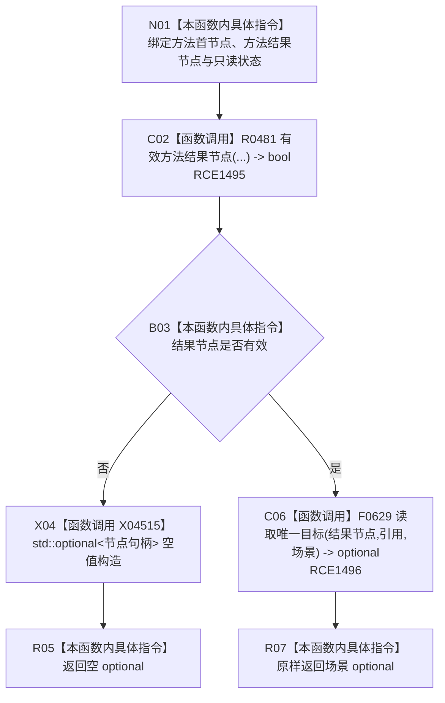

# CF-L11-0101 方法服务读取方法结果场景现状流程图

图类型：现状流程图
代码版本：`0a93526882cb33c61c2fbb04ecad1aeaddcfe225`
当前工作区复核基线：`ece29318f80cad2ce7a4abce9b009c60cd4cdfdd`
源码 blob：`839dd462c70e8d54b6f22f1126d751ac9425398a`
覆盖文件：`海中鱼巣/领域/方法服务.h:909-915`
唯一根函数：R0493
完整签名：`std::optional<节点句柄> 海中鱼巣::方法服务::读取方法结果场景(节点句柄 方法首节点, 节点句柄 方法结果节点, const 状态服务& 状态) const`
参数：两个节点句柄值传入；`状态` 为调用期只读借用
返回结果：结果节点有效时返回其唯一场景引用；无效或无唯一目标时为空 optional
已登记调用方：R0290（RCE0963）
直接项目函数：R0481（RCE1495）、F0629（RCE1496）
外部边界：X04515（空节点句柄 optional 构造）
逐行映射表：`流程图/代码流程图/L11/CF-L11-0101_方法服务读取方法结果场景_逐行代码映射表.md`
不得作为施工许可：是
不得宣称：空结果已被目标契约裁决，或场景关系已经通过运行验证

## 流程图

## 关键边界

- 无效结果节点在任何关系读取前返回空 optional，零结构写入。
- F0629 的唯一性判断与场景类型筛选由其独立现状图承载。
