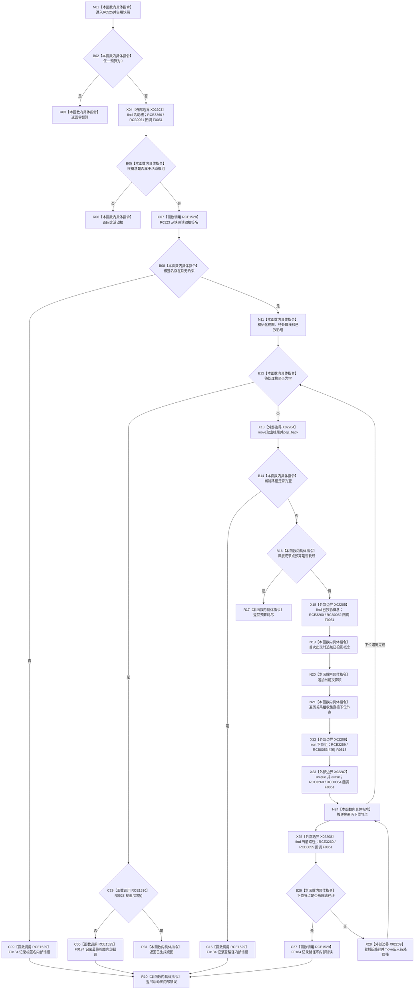

# CF-L11-0102 概念图服务生成抽象树视图现状流程图

图类型：现状流程图
代码版本：`0a93526882cb33c61c2fbb04ecad1aeaddcfe225`
工作区复核基线：`c3939fcd2fe13b6a5ba69e5dcad6efc519bdf667`
源码 blob：`dc4bd08f99622b3380c91dd15258fc8ab2e1b9c6`
覆盖文件：`海中鱼巣/领域/概念图服务.h:4331-4399`
唯一根函数：R0525
完整签名：`static 海中鱼巣::抽象树读取结果 海中鱼巣::概念图服务::生成抽象树视图(const 海中鱼巣::概念活动快照& 快照, 海中鱼巣::节点句柄 根概念, std::size_t 节点预算, std::size_t 深度预算)`
参数：快照为只读借用；根概念和两项预算按值
返回结果：返回零预算、非活动根、预算耗尽、活动图内部错误或已生成中的一个具名结果
已登记调用方：R0517（RCE1521）
已登记直接项目函数：R0523（RCE1528）、F0184（RCE1529）、R0528（RCE1530）
项目回调边：RCE3259（R0518）、RCE3260（F0051）；回调登记 RCB0051—RCB0055
外部边界：X02203—X02209、X04642—X04673
逐行映射表：`流程图/代码流程图/L11/CF-L11-0102_概念图服务生成抽象树视图_逐行代码映射表.md`
结构读写：只读活动快照，在局部容器中深度优先形成抽象树投影
不得作为施工许可：是
不得宣称：视图生成成功代表活动图本身满足全部业务规范或运行验收

## 流程图

## 当前边界

- 待处理栈使用“尾部弹出 + 下位逆序压入”，结合句柄排序形成稳定的深度优先投影顺序。
- 重复概念仍生成投影项但不重复加入 `已投影概念组`；路径环则按内部错误立即返回。
- 所有返回材料均来自局部值对象；函数不修改输入活动快照。
