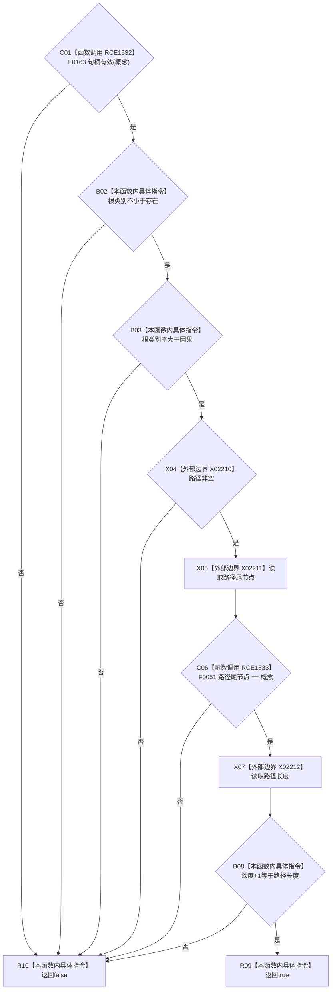

# CF-L11-0103 抽象树投影项完整现状流程图

图类型：现状流程图
代码版本：`0a93526882cb33c61c2fbb04ecad1aeaddcfe225`
工作区复核基线：`c3939fcd2fe13b6a5ba69e5dcad6efc519bdf667`
源码 blob：`dc4bd08f99622b3380c91dd15258fc8ab2e1b9c6`
覆盖文件：`海中鱼巣/领域/概念图服务.h:665-672`
唯一根函数：R0527
完整签名：`bool 海中鱼巣::抽象树投影项::完整() const`
参数：无显式参数；只读当前投影项
返回结果：概念句柄有效、根类别处于存在至因果、路径非空且尾节点与概念一致、深度等于路径长度减一时返回 `true`
已登记调用方：R0279（RCE0900）、R0529（RCE1537）
直接项目函数：F0163（RCE1532）、F0051（RCE1533）
外部边界：X02210—X02212
逐行映射表：`流程图/代码流程图/L11/CF-L11-0103_抽象树投影项完整_逐行代码映射表.md`
结构读写：只读投影项字段和路径容器
不得作为施工许可：是
不得宣称：单项完整代表整棵抽象树视图完整或无重复投影

## 流程图

## 当前边界

- 检查按 `&&` 从左到右短路，路径为空时不会调用 `back()`。
- `重复投影` 与 `名称入口组` 不参与单项完整性判断。
