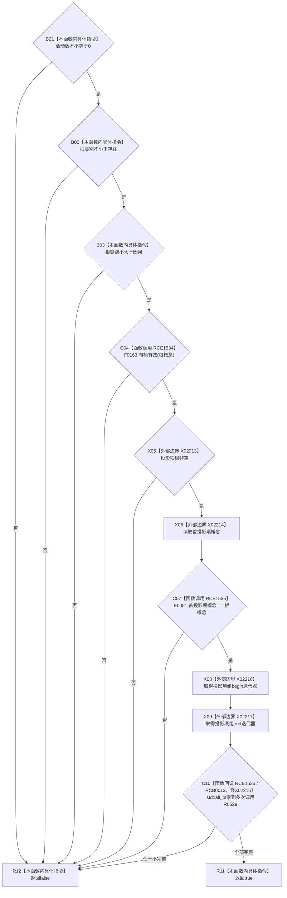

# CF-L11-0104 抽象树视图材料完整现状流程图

图类型：现状流程图
代码版本：`0a93526882cb33c61c2fbb04ecad1aeaddcfe225`
工作区复核基线：`2089268fbb3833ebc77486169b98d8a14c49d508`
源码 blob：`dc4bd08f99622b3380c91dd15258fc8ab2e1b9c6`
覆盖文件：`海中鱼巣/领域/概念图服务.h:681-691`
唯一根函数：R0528
完整签名：`bool 海中鱼巣::抽象树视图材料::完整() const`
参数：无显式参数；只读当前抽象树视图材料
返回结果：活动版本、根类别、根概念、首投影项与全部投影项均满足当前代码条件时返回 `true`，否则按 `&&` 短路返回 `false`
已登记调用方：R0525（RCE1530）
直接项目函数：F0163（RCE1534）、F0051（RCE1535）、R0529（RCE1536；RCB0012）
外部边界：X02213—X02217
逐行映射表：`流程图/代码流程图/L11/CF-L11-0104_抽象树视图材料完整_逐行代码映射表.md`
结构读写：只读视图字段与投影项组
不得作为施工许可：是
不得宣称：材料完整代表抽象树来源、规范语义或业务验收正确

## 流程图

## 当前边界

- 所有条件按源码 `&&` 从左向右短路；投影项组为空时不会调用 `front()` 或 `std::all_of`。
- R0529 是标准算法的项目回调；X02215 只表示标准库算法边界，不替代 RCE1536 与 RCB0012。
