# CF-L11-0105 读取最近结算记录现状流程图

图类型：现状流程图
代码版本：`03a8b7ac099ccea83e57f2696e2290b7bcdfacaf`
工作区复核基线：`7edb47f7b58aa71a10c225790e41f1d6c12a0cbd`
源码 blob：`e41b0c665b360232e55ede728f2a4d561c5c9d32`
覆盖文件：`海中鱼巣/领域/需求服务.h:704-746`
唯一根函数：R0587
完整签名：`std::optional<节点句柄> 海中鱼巣::需求服务::读取最近结算记录(节点句柄 需求节点, const 状态服务& 状态) const`
参数：`需求节点` 按值传入；`状态` 以只读引用借用
返回结果：从需求节点的归属关系中选出完整且可读取时间戳与节点记录的最近结算；若需求类型不符、无有效候选或出现三重排序键相同但目标不同的不可区分候选则返回 `std::nullopt`
已登记调用方：R0286（RCE0927）
直接项目函数：R0729（RCE2227）、F0575（RCE1616）、R0596（RCE1617）、R0871（RCE3319）、F0190（RCE3320）、F0051（RCE3321）
外部边界：X02259—X02264、X04799—X04804
逐行映射表：`流程图/代码流程图/L11/CF-L11-0105_读取最近结算记录_逐行代码映射表.md`
结构读写：只读需求类型、归属关系、结算记录、发生时间戳和节点记录；仅更新局部最近候选及其排序键
不得作为施工许可：是
不得宣称：返回某个结算节点代表结算内容正确、需求已经完成或任何业务能力已经验收

## 流程图

```mermaid
flowchart TD
    N01["N01【本函数内具体指令】进入 R0587 并绑定需求节点与状态服务"]
    C02["C02【函数调用 RCE2227】R0729 检查需求节点类型"]
    B03{"B03【本函数内具体指令】节点类型是需求"}
    R04["R04【本函数内具体指令】返回 std::nullopt"]
    C05["C05【函数调用 RCE1616】F0575 读取需求节点的归属关系记录组"]
    N06["N06【本函数内具体指令】最近关系置空"]
    N07["N07【本函数内具体指令】最近时间戳置0"]
    N08["N08【本函数内具体指令】最近创建序号置0"]
    X09A["X09A【外部边界 X04799/X04800】取得关系记录组 begin/end 迭代器"]
    X09B{"X09B【外部边界 X04801】当前迭代器不等于 end"}
    X09C["X09C【外部边界 X04802】解引用当前迭代器取得关系记录"]
    X09D["X09D【外部边界 X04803】递增当前迭代器"]
    C10["C10【函数调用 RCE1617】R0596 检查当前目标的结算记录完整性"]
    B11{"B11【本函数内具体指令】结算记录完整"}
    C12["C12【函数调用 RCE3319】R0871 读取当前目标的发生时间戳"]
    C13["C13【函数调用 RCE3320】F0190 读取当前目标的节点记录"]
    X14["X14【外部边界 X02260】检查时间戳 optional 是否有值"]
    X15["X15【外部边界 X02259】检查节点记录 optional 是否有值"]
    B16{"B16【本函数内具体指令】时间戳与节点记录都有值"}
    X17["X17【外部边界 X02261/X02262/X02263/X02264】读取最近候选存在性、时间戳、顺序号与创建序号"]
    B18{"B18【本函数内具体指令】当前记录按时间戳/顺序号/创建序号更新为最近"}
    X19["X19【外部边界 X02261/X02262/X02263/X02264】读取不可区分判断所需的最近候选与三重排序键"]
    B20{"B20【本函数内具体指令】已有候选且三重排序键完全相同"}
    C21["C21【函数调用 RCE3321】F0051 比较当前与最近目标节点句柄"]
    B22{"B22【本函数内具体指令】两个目标节点不同"}
    R23["R23【本函数内具体指令】返回 std::nullopt 拒绝不可区分候选"]
    B24{"B24【本函数内具体指令】更新为最近"}
    X25["X25【外部边界 X04804】把当前关系记录赋给最近关系 optional"]
    X26["X26【外部边界 X02262】读取当前发生时间戳值"]
    N27["N27【本函数内具体指令】写入最近时间戳"]
    X28["X28【外部边界 X02264】读取当前节点创建序号"]
    N29["N29【本函数内具体指令】写入最近创建序号"]
    X30["X30【外部边界 X02261】检查最终最近关系 optional 是否有值"]
    B31{"B31【本函数内具体指令】最终存在最近关系"}
    R32["R32【本函数内具体指令】返回 std::nullopt"]
    X33["X33【外部边界 X02263】读取最近关系目标节点"]
    R34["R34【本函数内具体指令】返回最近结算目标节点"]
    N01 --> C02 --> B03
    B03 -- 否 --> R04
    B03 -- 是 --> C05 --> N06 --> N07 --> N08 --> X09A --> X09B
    X09B -- 是 --> X09C --> C10 --> B11
    B11 -- 否 --> X09D --> X09B
    B11 -- 是 --> C12 --> C13 --> X14 --> X15 --> B16
    B16 -- 否 --> X09D
    B16 -- 是 --> X17 --> B18 --> X19 --> B20
    B20 -- 是 --> C21 --> B22
    B22 -- 是 --> R23
    B22 -- 否 --> B24
    B20 -- 否 --> B24
    B24 -- 否 --> X09D
    B24 -- 是 --> X25 --> X26 --> N27 --> X28 --> N29 --> X09D
    X09B -- 否 --> X30 --> B31
    B31 -- 否 --> R32
    B31 -- 是 --> X33 --> R34
```

## 当前边界

- 候选先通过结算记录完整性、时间戳可读和节点记录可读三道过滤，再按发生时间戳、归属关系顺序号、节点创建序号依次择新。
- 两条不同目标若三重排序键完全相同，函数直接返回空 optional，不以遍历顺序任意选取其一。
- `RCE1616` 已按静态接收者与两实参重新绑定到 F0575 非令牌重载；RCE3319—RCE3321 是本批源码复核补齐的稳定项目边。
- X04799—X04803 对应范围 `for` 的 begin/end、比较、解引用与递增；X04804 对应把当前关系记录赋给最近关系 optional。
