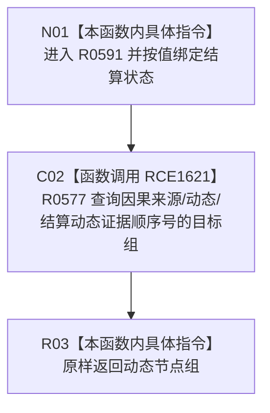

# CF-L11-0109 读取结算动态证据现状流程图

图类型：现状流程图
代码版本：`03a8b7ac099ccea83e57f2696e2290b7bcdfacaf`
工作区复核基线：`7edb47f7b58aa71a10c225790e41f1d6c12a0cbd`
源码 blob：`e41b0c665b360232e55ede728f2a4d561c5c9d32`
覆盖文件：`海中鱼巣/领域/需求服务.h:760-762`
唯一根函数：R0591
完整签名：`std::vector<节点句柄> 海中鱼巣::需求服务::读取结算动态证据(节点句柄 结算状态) const`
参数：`结算状态` 按值传入
返回结果：返回 R0577 对结算动态证据角色的目标节点组查询结果
已登记调用方：R0286（RCE0931）、R0596（RCE1631）
直接项目函数：R0577（RCE1621）
外部边界：无
逐行映射表：`流程图/代码流程图/L11/CF-L11-0109_读取结算动态证据_逐行代码映射表.md`
结构读写：本函数不直接写结构；下沉到 R0577 读取结算状态的因果来源关系组
不得作为施工许可：是
不得宣称：返回非空动态证据组代表动态证据有效、结算记录完整或业务能力已完成

## 流程图

## 当前边界

- 本函数只固定因果来源关系、动态节点类型和结算动态证据顺序号。
- 空组、过滤、排序或重复处理的具体口径由 R0577 的结算目标组读取过程决定。
