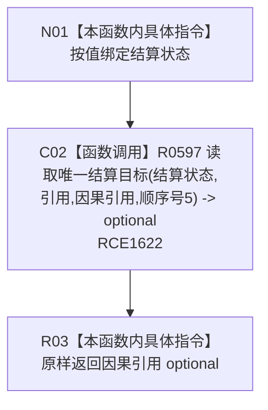

# CF-L11-0110 读取结算因果引用现状流程图

图类型：现状流程图
代码版本：`03a8b7ac099ccea83e57f2696e2290b7bcdfacaf`
当前工作区复核基线：`7edb47f7b58aa71a10c225790e41f1d6c12a0cbd`
源码 blob：`e41b0c665b360232e55ede728f2a4d561c5c9d32`
覆盖文件：`海中鱼巣/领域/需求服务.h:764-767`
唯一根函数：R0592
完整签名：`std::optional<节点句柄> 海中鱼巣::需求服务::读取结算因果引用(节点句柄 结算状态) const`
参数：`结算状态` 按值输入
返回结果：原样返回 R0597 对引用关系、因果引用类型和结算因果引用顺序号的唯一目标查询结果
已登记调用方：R0286（RCE0932）
直接项目函数：R0597（RCE1622）
外部边界：无
逐行映射表：`流程图/代码流程图/L11/CF-L11-0110_读取结算因果引用_逐行代码映射表.md`
结构读写：本函数不直接修改结构；R0597 只读节点与关系
不得作为施工许可：是
不得宣称：返回有值代表结算记录完整，或因果引用已经通过运行验证

## 流程图

## 当前边界

- 本函数只固定查询条件并委托 R0597，不验证其它结算字段。
- 空 optional 同时覆盖结算状态类型不匹配、无匹配目标和多匹配目标，具体分支由 R0597 的独立现状图承载。
