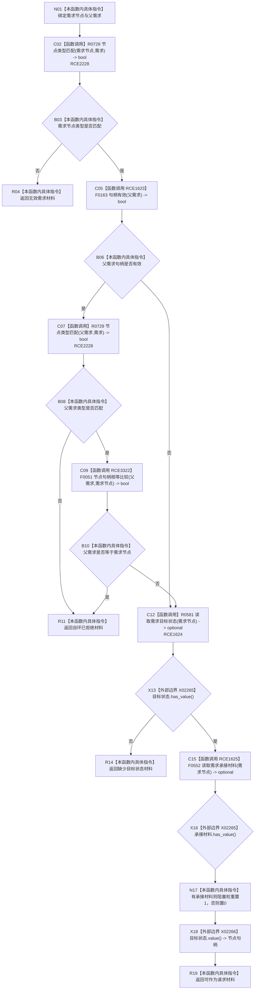

# CF-L11-0111 读取需求树后续结构材料现状流程图

图类型：现状流程图
代码版本：`03a8b7ac099ccea83e57f2696e2290b7bcdfacaf`
当前工作区复核基线：`7edb47f7b58aa71a10c225790e41f1d6c12a0cbd`
源码 blob：`e41b0c665b360232e55ede728f2a4d561c5c9d32`
覆盖文件：`海中鱼巣/领域/需求服务.h:769-783`
唯一根函数：R0593
完整签名：`需求树后续结构材料 海中鱼巣::需求服务::读取需求树后续结构材料(节点句柄 需求节点, 节点句柄 父需求 = {}) const`
参数：`需求节点` 与可选语义的 `父需求` 均按值输入；缺省父需求为空句柄
返回结果：返回携带输入句柄、目标状态、阻塞权重和请求状态的需求树后续结构材料
已登记调用方：R0286（RCE0915）
直接项目函数：R0729（RCE2228）、F0163（RCE1623）、F0051（RCE3322）、R0581（RCE1624）、F0552（RCE1625）
外部边界：X02265（`optional::has_value`）、X02266（`optional::value`）
逐行映射表：`流程图/代码流程图/L11/CF-L11-0111_读取需求树后续结构材料_逐行代码映射表.md`
结构读写：只读节点和关系，局部计算阻塞权重，不修改项目结构
不得作为施工许可：是
不得宣称：返回可作为请求材料代表后续结构已经创建

## 流程图

## 当前边界

- 需求节点无效、父需求类型无效或自环、缺少目标状态分别形成三种具名返回；全部发生在返回材料构造前，且本函数零结构写入。
- 阻塞权重仅由承接材料 optional 是否有值决定，不携带承接失败原因。
- RCE1623、RCE1625 已按源码静态实参改绑到无令牌重载；RCE3322 记录父需求与需求节点的句柄比较。
