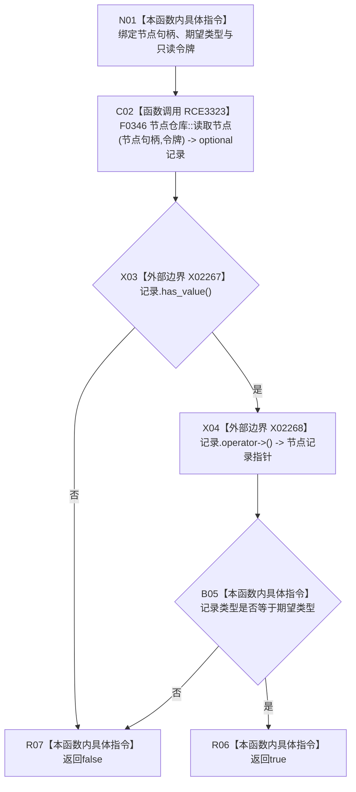

# CF-L11-0112 节点类型匹配令牌现状流程图

图类型：现状流程图
代码版本：`03a8b7ac099ccea83e57f2696e2290b7bcdfacaf`
当前工作区复核基线：`7edb47f7b58aa71a10c225790e41f1d6c12a0cbd`
源码 blob：`e41b0c665b360232e55ede728f2a4d561c5c9d32`
覆盖文件：`海中鱼巣/领域/需求服务.h:812-818`
唯一根函数：R0594
完整签名：`bool 海中鱼巣::需求服务::节点类型匹配_令牌(节点句柄 节点句柄值, 节点类型 类型, const 结构事务令牌& 令牌) const`
参数：节点句柄与期望类型按值输入；`令牌` 为调用期只读借用
返回结果：令牌读取到节点记录且记录类型等于期望类型时返回 `true`，否则返回 `false`
已登记调用方：R0580（RCE1606）
直接项目函数：F0346（RCE3323，令牌重载读取节点）
外部边界：X02267（`optional::has_value`）、X02268（`optional::operator->`）
逐行映射表：`流程图/代码流程图/L11/CF-L11-0112_节点类型匹配令牌_逐行代码映射表.md`
结构读写：通过给定令牌只读节点记录，不修改结构
不得作为施工许可：是
不得宣称：`false` 已区分节点不存在、令牌无效和节点类型不同

## 流程图

## 当前边界

- `&&` 保持左到右短路；记录无值时不执行 `operator->`。
- 节点仓库令牌重载 F0346 的直接项目调用由 RCE3323 稳定登记。
