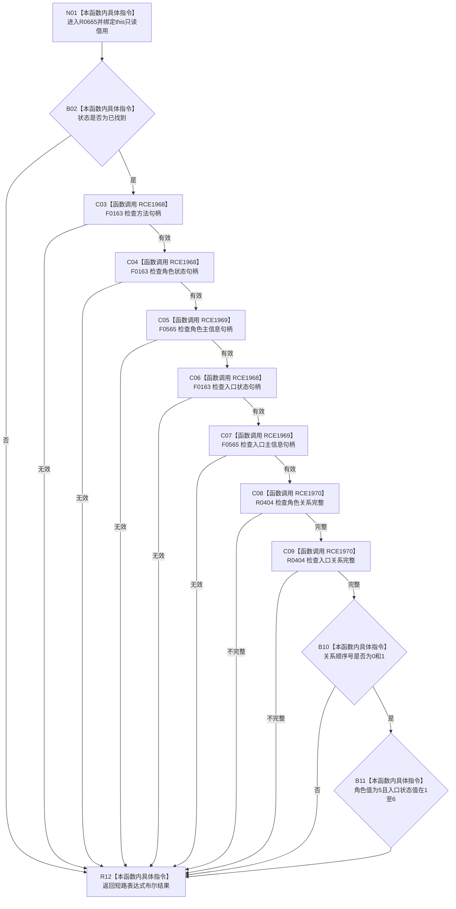

# CF-L11-0114 来源动作角色材料是动作入口现状流程图

图类型：现状流程图
代码版本：`03a8b7ac099ccea83e57f2696e2290b7bcdfacaf`
当前工作区复核基线：`f19e4b0e001554d25b1cf0847dbcfb0b52d4e22c`
源码 blob：`cc399ea69282bf3ae0b0d59c7f0b587e5164b187`
覆盖文件：`海中鱼巣/领域/数据操作.状态动态.ixx:120-127`
唯一根函数：R0665
完整签名：`bool 海中鱼巣::来源动作角色材料::是动作入口() const noexcept`
参数：隐式 `this` 为调用期间有效的非拥有只读借用
返回结果：材料已找到，方法、角色状态/主信息、入口状态/主信息均有效，两条关系完整且顺序号为 0/1，角色值为 5，入口状态值位于 1—6 时返回 `true`；否则返回 `false`
已登记调用方：R0669（RCE2006）
直接项目函数：F0163（RCE1968，三次）、F0565（RCE1969，两次）、R0404（RCE1970，两次）
外部边界：无
逐行映射表：`流程图/代码流程图/L11/CF-L11-0114_来源动作角色材料是动作入口_逐行代码映射表.md`
调用图：`流程图/主程序可达调用关系/01_main可达项目调用边表.md`；入边 RCE2006，出边 RCE1968—RCE1970
输入契约 / 调用语境表：本图参数、返回结果和“当前边界”内嵌审查；无独立文件
非成功返回二分审查表：本图逻辑内返回和“当前边界”内嵌审查；无独立文件
偏差清单：本函数当前代码事实未发现需单列偏差；无独立文件
依据提交 / 结构化消息：冻结代码提交 `03a8b7ac099ccea83e57f2696e2290b7bcdfacaf`；流程图维护切片复核基线 `f19e4b0e001554d25b1cf0847dbcfb0b52d4e22c`
验证输出：逐行覆盖、Mermaid/节点集合与未跟踪文件差异检查通过；`check_specs.py --strict` 为 108/108 PASS
结构读写：只读材料字段和关系证据
逻辑内返回：任一短路条件不成立时返回 `false`
内部错误：本函数无独立内部错误分支
生命周期与资源释放：无资源获取
不得作为施工许可：是
不得宣称：返回 `true` 等于来源动作或其因果结构已经完整发布

## 流程图

## 当前边界

- 第 121—126 行是单一 `&&` 短路链；只有前项成立才执行后续句柄或关系检查。
- 两条关系不仅要求完整，还要求角色关系顺序号为 0、入口关系顺序号为 1。
- 入口状态值范围是闭区间 `[1, 6]`。
