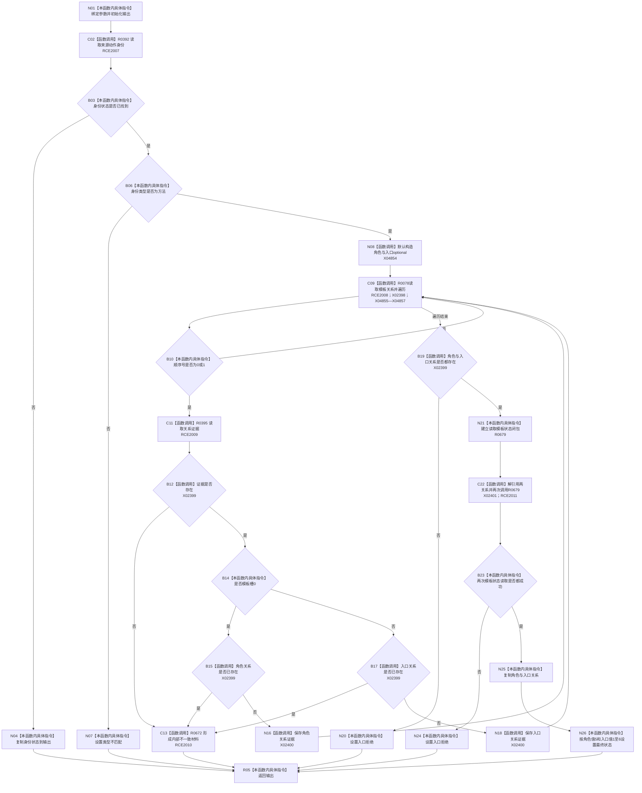

# CF-L11-0115 读取来源动作角色已许可现状流程图

图类型：现状流程图
代码版本：`03a8b7ac099ccea83e57f2696e2290b7bcdfacaf`
当前工作区复核基线：`f19e4b0e001554d25b1cf0847dbcfb0b52d4e22c`
源码 blob：`cc399ea69282bf3ae0b0d59c7f0b587e5164b187`
覆盖文件：`海中鱼巣/领域/数据操作.状态动态.ixx:1146-1202`
唯一根函数：R0670
完整签名：`海中鱼巣::来源动作角色材料 海中鱼巣::状态动态数据操作::读取来源动作角色_已许可(海中鱼巣::节点句柄 来源动作, const 海中鱼巣::结构事务令牌& 令牌) const`
参数：`来源动作` 按值输入；`令牌` 只读借用，调用方负责许可有效性
返回结果：返回来源动作角色材料；身份读取失败沿用原状态，类型不符返回类型不匹配，模板不完整或状态合同不满足返回入口拒绝，内部关系不一致返回内部不一致材料
已登记调用方：R0669（RCE2005）
直接项目函数：R0392（RCE2007）、R0078（RCE2008）、R0395（RCE2009）、R0672（RCE2010）、R0679（RCE2011）
外部边界：X02398—X02401、X04854—X04857
调用图：`流程图/主程序可达调用关系/00_main可达函数身份表.md`、`01_main可达项目调用边表.md`、`02_main可达外部边界表.md`
逐行映射表：`流程图/代码流程图/L11/CF-L11-0115_读取来源动作角色已许可_逐行代码映射表.md`
输入契约 / 调用语境表：本图内嵌审查；无独立文件
非成功返回二分审查表：本图内嵌审查；入口拒绝与结构内部不一致分账
偏差清单：无独立文件；本批只记录当前代码事实
依据提交 / 结构化消息：冻结源码提交 `03a8b7ac099ccea83e57f2696e2290b7bcdfacaf`、正式稳定边表及顶层稳定边界 ID 裁决 X04854—X04857
验证输出：Mermaid / 节点集合 / 逐行覆盖 PASS；目标 no-index 与全仓 diff 检查 PASS；strict 108/108 PASS；未构建、未运行
不得作为施工许可：是
不得宣称：传入令牌合法、来源动作一定满足角色合同，或内部不一致已被运行验证触发

## 流程图

## 当前边界

- 1180—1190 行的 lambda 正文属于独立函数 R0679；本图记录闭包建立及 1191—1192 的两次直接调用。
- 模板槽缺失和模板状态合同不满足均返回 `入口拒绝`；模板关系证据缺失或槽位重复通过 R0672 形成内部不一致材料。
