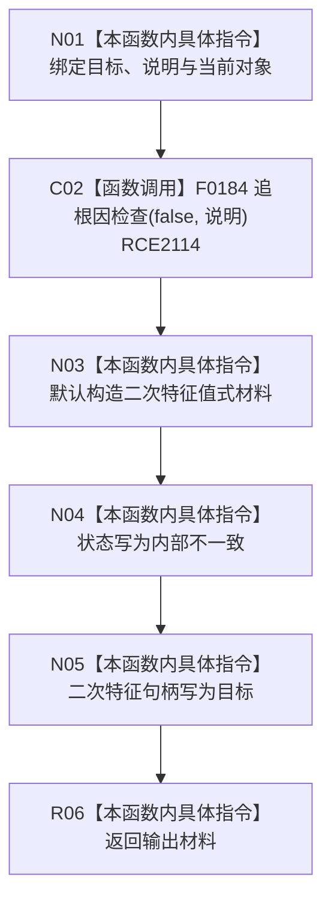

# CF-L11-0117 二次特征内部不一致现状流程图

图类型：现状流程图
代码版本：`03a8b7ac099ccea83e57f2696e2290b7bcdfacaf`
当前工作区复核基线：`b8a49bcb141d4fb8940225954dc328e54600030b`
源码 blob：`a47cd9b07794d30abc6cb9d1df319056105cd596`
覆盖文件：`海中鱼巣/领域/数据操作.特征体系.ixx:1410-1416`
唯一根函数：R0706
完整签名：`海中鱼巣::二次特征值式材料 海中鱼巣::特征体系数据操作::二次特征内部不一致(海中鱼巣::节点句柄 目标, const wchar_t* 说明) const`
参数：`目标` 按值传入节点句柄；`说明` 为只读、非拥有诊断文本指针；只读当前数据操作对象
返回结果：触发追根因检查后返回状态为 `内部不一致`、二次特征句柄为 `目标` 的值式材料
调用图：`流程图/主程序可达调用关系/00_main可达函数身份表.md`、`01_main可达项目调用边表.md`、`02_main可达外部边界表.md`
已登记调用方：R0705（RCE2113，七个结构不一致调用点）
直接项目函数：F0184（RCE2114）
外部边界：无
逐行映射表：`流程图/代码流程图/L11/CF-L11-0117_二次特征内部不一致_逐行代码映射表.md`
输入契约 / 调用语境表：本图内嵌审查；仅在二次特征结构已经出现内部不一致时进入
非成功返回二分审查表：本图内嵌审查；固定为追根因解决
偏差清单：无独立文件；本批只记录当前代码事实
依据提交 / 结构化消息：冻结源码提交 `03a8b7ac099ccea83e57f2696e2290b7bcdfacaf` 与正式稳定边表
验证输出：Mermaid / 节点集合 / 逐行覆盖 PASS；目标 no-index 与 strict 检查 PASS；未构建、未运行
不得作为施工许可：是
不得宣称：追根因检查已经修复二次特征结构，或该返回材料已经通过运行验证

## 流程图

## 当前边界

- 说明文本只进入诊断检查，不成为机器结构字段。
- 本函数不修复结构；结构化事实是返回材料中的 `内部不一致` 状态和目标句柄。
