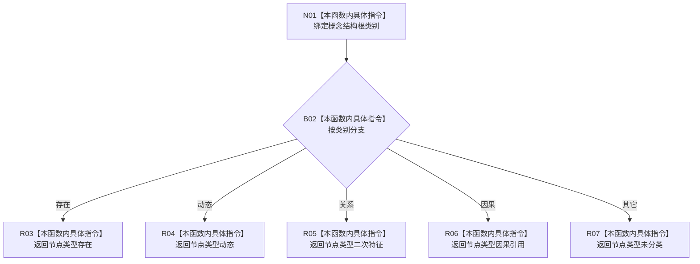

# CF-L11-0118 根类别节点类型现状流程图

图类型：现状流程图
代码版本：`03a8b7ac099ccea83e57f2696e2290b7bcdfacaf`
当前工作区复核基线：`b8a49bcb141d4fb8940225954dc328e54600030b`
源码 blob：`ab7997e84df13fa2105b364f0fdb369d47d9c181`
覆盖文件：`海中鱼巣/领域/数据操作.概念图结构.ixx:348-356`
唯一根函数：R0718
完整签名：`static 海中鱼巣::节点类型 海中鱼巣::概念图结构数据操作::根类别节点类型(海中鱼巣::概念结构根类别 类别) noexcept`
参数：`类别` 按值输入
返回结果：存在/动态/关系/因果分别映射为存在/动态/二次特征/因果引用；其它映射为未分类
调用图：`流程图/主程序可达调用关系/00_main可达函数身份表.md`、`01_main可达项目调用边表.md`、`02_main可达外部边界表.md`
已登记调用方：R0720（RCE2135）
直接项目函数：无
外部边界：无
逐行映射表：`流程图/代码流程图/L11/CF-L11-0118_根类别节点类型_逐行代码映射表.md`
输入契约 / 调用语境表：本图内嵌审查；类别由概念根候选提供
非成功返回二分审查表：本图内嵌审查；未知类别以未分类返回
偏差清单：无独立文件；本批只记录当前代码事实
依据提交 / 结构化消息：冻结源码提交 `03a8b7ac099ccea83e57f2696e2290b7bcdfacaf` 与正式稳定边表
验证输出：Mermaid / 节点集合 / 逐行覆盖 PASS；目标 no-index 与全仓 diff 检查 PASS；strict 108/108 PASS；未构建、未运行
不得作为施工许可：是
不得宣称：返回类型证明对应节点当前存在

## 流程图

## 当前边界

- “关系”根类别映射到 `节点类型::二次特征`，不是 `节点类型::关系`。
