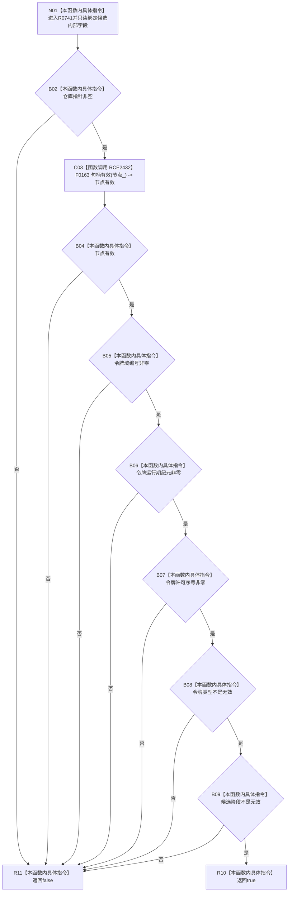

# CF-L11-0121 节点未发布候选完整现状流程图

图类型：现状流程图
代码版本：`03a8b7ac099ccea83e57f2696e2290b7bcdfacaf`
当前工作区复核基线：`8632fb891fb3beea255aff1946c07b0fe975ef2b`
源码 blob：`9f8ef9a14937b13af5f31f9c8fc3457dd0078ead`
覆盖文件：`海中鱼巣/核心/节点仓库.h:39-43`
唯一根函数：R0741
完整签名：`bool 海中鱼巣::节点未发布候选::完整() const`
参数：无显式参数；只读候选持有的仓库、节点、令牌与阶段
返回结果：仓库、节点、令牌各身份字段与候选阶段全部有效时返回 `true`，否则短路返回 `false`
调用图：`流程图/主程序可达调用关系/00_main可达函数身份表.md`、`01_main可达项目调用边表.md`、`02_main可达外部边界表.md`
已登记调用方：R0022、R0048
直接项目函数：F0163（RCE2432）
外部边界：无
逐行映射表：`流程图/代码流程图/L11/CF-L11-0121_节点未发布候选完整_逐行代码映射表.md`
输入契约 / 调用语境表：本图内嵌审查；当前候选由节点仓库创建并由会话查询完整性
非成功返回二分审查表：本图内嵌审查；`false` 表示候选内部任一必要身份材料无效
偏差清单：无独立文件；本批只记录当前代码事实
依据提交 / 结构化消息：冻结源码提交 `03a8b7ac099ccea83e57f2696e2290b7bcdfacaf` 与正式身份、调用边表
验证输出：Mermaid / 节点集合 / 逐行覆盖 PASS；目标 no-index 与全仓 diff 检查 PASS；strict 108/108 PASS；未构建、未运行
不得作为施工许可：是
不得宣称：完整候选已经确认、发布或形成可读节点事实

## 流程图

## 当前边界

- 本函数只核对候选携带材料的形态完整性，不读取仓库记录或确认发布状态。
