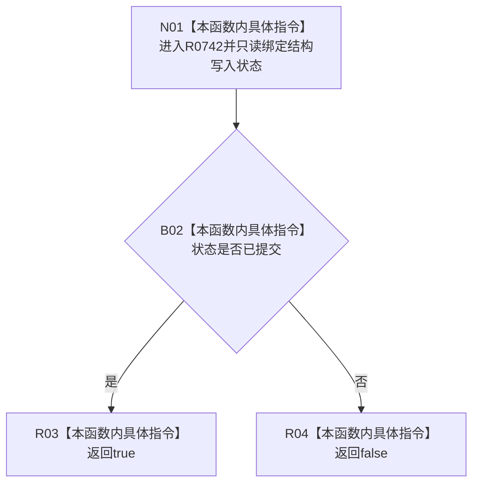

# CF-L11-0122 结构写入结果改变了结构现状流程图

图类型：现状流程图
代码版本：`03a8b7ac099ccea83e57f2696e2290b7bcdfacaf`
当前工作区复核基线：`8632fb891fb3beea255aff1946c07b0fe975ef2b`
源码 blob：`f54942715c7fce9a678f47fe595ec2080e04427d`
覆盖文件：`海中鱼巣/核心/结果.结构写入.h:33-35`
唯一根函数：R0742
完整签名：`bool 海中鱼巣::结构写入结果::改变了结构() const noexcept`
参数：无显式参数；只读当前结构写入状态
返回结果：状态恰为 `已提交` 时返回 `true`，其它状态返回 `false`
调用图：`流程图/主程序可达调用关系/00_main可达函数身份表.md`、`01_main可达项目调用边表.md`、`02_main可达外部边界表.md`
已登记调用方：R0023、R0024、R0027
直接项目函数：无
外部边界：无
逐行映射表：`流程图/代码流程图/L11/CF-L11-0122_结构写入结果改变了结构_逐行代码映射表.md`
输入契约 / 调用语境表：本图内嵌审查；调用方查询已形成的结构写入结果状态
非成功返回二分审查表：本图内嵌审查；`false` 仅表示该状态不分类为本次改变结构
偏差清单：无独立文件；本批只记录当前代码事实
依据提交 / 结构化消息：冻结源码提交 `03a8b7ac099ccea83e57f2696e2290b7bcdfacaf` 与正式身份表
验证输出：Mermaid / 节点集合 / 逐行覆盖 PASS；目标 no-index 与全仓 diff 检查 PASS；strict 108/108 PASS；未构建、未运行
不得作为施工许可：是
不得宣称：状态为已提交已经由本函数独立读回或验收

## 流程图

## 当前边界

- 本函数不读取结构编号、版本或仓库，只按结果状态分类。
