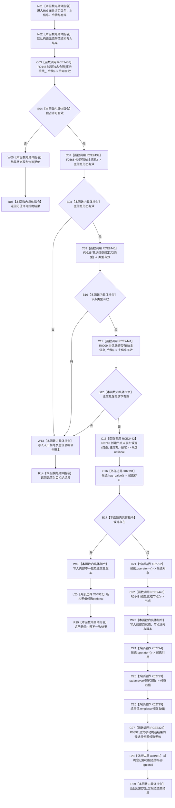

# CF-L11-0123 结构化创建节点未发布候选现状流程图

图类型：现状流程图
代码版本：`03a8b7ac099ccea83e57f2696e2290b7bcdfacaf`
当前工作区复核基线：`8632fb891fb3beea255aff1946c07b0fe975ef2b`
源码 blob：`f38b979a3f7cefd182a50e0b687c5a6fffebc91c`
覆盖文件：`海中鱼巣/核心/节点仓库.cpp:83-107`
唯一根函数：R0745
完整签名：`海中鱼巣::带值结构写入结果<海中鱼巣::节点未发布候选> 海中鱼巣::节点仓库::结构化创建节点未发布候选(海中鱼巣::节点类型 类型, 海中鱼巣::主信息句柄 主信息, const 海中鱼巣::结构事务令牌& 令牌)`
参数：`类型`、`主信息` 为值传递；`令牌` 为只读引用且由调用方保持生命周期；仓库持有事务接线与主信息仓库
返回结果：许可或入口失败时返回无值结果；内部创建无候选时返回内部不一致；成功时返回已提交操作与移动后的节点未发布候选值
调用图：`流程图/主程序可达调用关系/00_main可达函数身份表.md`、`01_main可达项目调用边表.md`、`02_main可达外部边界表.md`
已登记调用方：R0022
直接项目函数：R0145（RCE2438）、F0565（RCE2439）、F0625（RCE2440）、R0009（RCE2441）、R0746（RCE2442）、R0148（RCE2443）、R0892（RCE3328；被调图按队列待绘制）
外部边界：X02791—X02795、X04915
逐行映射表：`流程图/代码流程图/L11/CF-L11-0123_结构化创建节点未发布候选_逐行代码映射表.md`
输入契约 / 调用语境表：本图内嵌审查；结构写入会话提供节点类型、主信息与独占事务令牌
非成功返回二分审查表：本图内嵌审查；令牌或入口材料失败为具名拒绝，前置通过但候选为空为内部不一致
偏差清单：无独立文件；本批只记录当前代码事实
依据提交 / 结构化消息：冻结源码提交 `03a8b7ac099ccea83e57f2696e2290b7bcdfacaf`、正式图谱与顶层 R0892 / RCE3328 / X04915 稳定身份裁决
验证输出：Mermaid / 节点集合 / 逐行覆盖 PASS；目标 no-index 与全仓 diff 检查 PASS；strict 108/108 PASS；未构建、未运行
不得作为施工许可：是
不得宣称：返回已提交候选已经确认、发布或形成调用方可读的最终节点事实

## 流程图

## 当前边界

- R0892 是 `节点未发布候选` 的显式移动构造函数；本图只记录经 `optional::emplace` 触发的项目调用，R0892 自身图按正式队列后续绘制。
- X04915 统一承载局部 `optional<节点未发布候选>` 在有值和无值返回路径上的生命周期结束；候选的隐式析构不另建项目身份。
