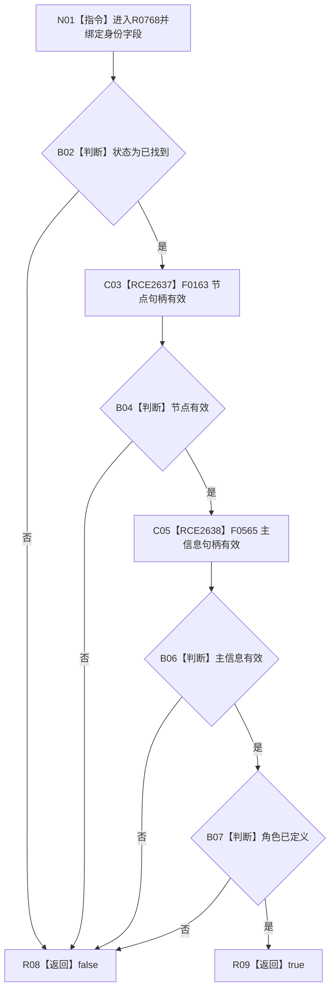

# CF-L11-0124 语义节点身份当前可读现状流程图

图类型：现状流程图
代码版本：`03a8b7ac099ccea83e57f2696e2290b7bcdfacaf`
当前工作区复核基线：`ef4f7bda76c92c0eb11456cfa267d76f35810616`
源码 blob：`ccde9a574e3817b75e3d02c9c8f88e244327c06a`
覆盖文件：`海中鱼巣/领域/数据操作.语素基础.ixx:88-91`
唯一根函数：R0768
完整签名：`bool 海中鱼巣::语义节点身份::当前可读() const noexcept`
参数：无显式参数；只读状态、节点、主信息与角色
返回结果：四项条件均成立返回 true，否则 false
调用图：`流程图/主程序可达调用关系/00_main可达函数身份表.md`、`01_main可达项目调用边表.md`、`02_main可达外部边界表.md`
已登记调用方：R0774
直接项目函数：F0163（RCE2637）、F0565（RCE2638）
外部边界：无
逐行映射表：`流程图/代码流程图/L11/CF-L11-0124_语义节点身份当前可读_逐行代码映射表.md`
输入契约 / 调用语境表：本图内嵌审查；读取结果调用方查询身份材料可读性
非成功返回二分审查表：本图内嵌审查；false 为材料不完整分类
偏差清单：无独立文件；本批只记录当前代码事实
依据提交 / 结构化消息：冻结源码提交 `03a8b7ac099ccea83e57f2696e2290b7bcdfacaf`、正式图谱与顶层稳定边裁决
验证输出：Mermaid / 节点集合 / 逐行覆盖 PASS；目标 no-index 检查 PASS；未构建、未运行
不得作为施工许可：是
不得宣称：身份已经由仓库独立读回

## 流程图

## 当前边界

- 本函数只做值式材料形态检查。
