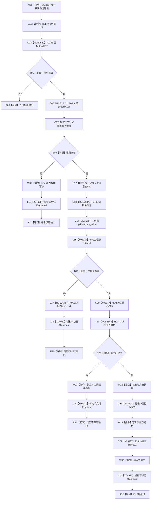

# CF-L11-0125 读取节点身份已许可现状流程图

图类型：现状流程图
代码版本：`03a8b7ac099ccea83e57f2696e2290b7bcdfacaf`
当前工作区复核基线：`ef4f7bda76c92c0eb11456cfa267d76f35810616`
源码 blob：`ccde9a574e3817b75e3d02c9c8f88e244327c06a`
覆盖文件：`海中鱼巣/领域/数据操作.语素基础.ixx:509-533`
唯一根函数：R0771
完整签名：`语义节点身份 海中鱼巣::语素基础数据操作::读取节点身份_已许可(节点句柄 目标, const 结构事务令牌& 令牌) const`
参数：目标值传递；令牌只读引用
返回结果：入口拒绝、版本漂移、内部不一致、类型不匹配或已找到身份
调用图：`流程图/主程序可达调用关系/00_main可达函数身份表.md`、`01_main可达项目调用边表.md`、`02_main可达外部边界表.md`
已登记调用方：R0774
直接项目函数：F0163、F0346、F0439、R0772、R0770（RCE2642—RCE2646）
外部边界：X03176—X03178、X04929、X04930；X03177 共四次
逐行映射表：`流程图/代码流程图/L11/CF-L11-0125_读取节点身份已许可_逐行代码映射表.md`
输入契约 / 调用语境表：本图内嵌审查；已许可基础信息读取先解析节点身份
非成功返回二分审查表：本图内嵌审查；节点记录缺失为版本漂移，主信息缺失为内部不一致，角色未定义为类型不匹配
偏差清单：无独立文件；本批只记录当前代码事实
依据提交 / 结构化消息：冻结源码提交 `03a8b7ac099ccea83e57f2696e2290b7bcdfacaf`、正式图谱与顶层稳定边裁决
验证输出：Mermaid / 节点集合 / 逐行覆盖 PASS；目标 no-index 检查 PASS；未构建、未运行
不得作为施工许可：是
不得宣称：身份结果已经完成业务验收

## 流程图

## 当前边界

- X03177 在 520、523、529、531 行分别读取记录字段，共四次。
